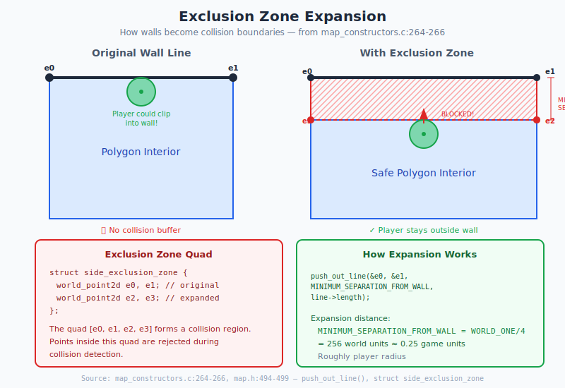

# Chapter 6: Physics and Collision

## Moving Through the Marathon World

> **For Porting:** `physics.c` and `world.c` are fully portable! No Mac dependencies. The collision detection uses pure fixed-point math against polygon geometry. Keep all code as-is.

> **Developer Diary:** From `world.c:1-23` (1992-1994), the arctangent function was notoriously troublesome:
>
> *"Thursday, January 21, 1993: fixed arctangent function."*
> *"Saturday, January 23, 1993: fixed arctangent, hopefully for the last time."*
> *"Wednesday, January 27, 1993: final fix to arctangent, we swear. recall lim(arctan(x)) as x approaches π/2 or 3π/4 is ±∞... because we didn't realize this, arctan failed in the case where x was very close to but slightly below π/2. i think we've seen the last monster suddenly 'panic' and bolt directly into a wall."*
> *"Sunday, July 25, 1993: the arctan of 0/0 is now (arbitrarily) π/2 because we're sick of assert(y) failing."*
>
> — Source: `world.c:1-23`

---

## 6.1 What Problem Are We Solving?

Marathon needs to simulate believable movement and detect collisions in a 3D world. This includes:

- **Player movement** - Walking, running, strafing, jumping, swimming
- **Gravity and falling** - Objects fall, but not infinitely fast
- **Wall collision** - Players and projectiles can't pass through walls
- **Object collision** - Players can't walk through monsters or scenery
- **Projectile physics** - Bullets, grenades, and rockets have trajectories
- **Environmental effects** - Water slows you down, lava damages you

**The constraints:**
- Must be **deterministic** - Same inputs = same outputs (critical for networking)
- Must be **fast** - Physics runs every tick (30 times per second)
- Must work with **1995 hardware** - No floating-point unit on 68K Macs

**Marathon's solution: Fixed-Point Mathematics**

Instead of floating-point numbers (which were slow and non-deterministic on different hardware), Marathon uses **fixed-point arithmetic**. This gives fractional precision using only integer operations.

---

## 6.2 Understanding Fixed-Point Math

Before diving into physics, let's understand how Marathon represents fractional numbers.

### The Problem with Integers

Integers can only represent whole numbers. If you try to store `0.5`, you get `0`:

```c
int x = 1 / 2;  // Result: 0 (integer division truncates)
```

### The Fixed-Point Solution

Fixed-point numbers use some bits for the integer part and some for the fractional part:

```
Standard fixed-point (16.16 format):
┌─────────────────────────────────┬─────────────────────────────────┐
│      16 bits: Integer part      │    16 bits: Fractional part     │
└─────────────────────────────────┴─────────────────────────────────┘

Example: Representing 1.5 in 16.16 fixed-point:
   Integer part:   1  (0x0001)
   Fractional part: 0.5 = 32768/65536 (0x8000)
   Combined:       0x00018000 = 98304

Verification: 98304 / 65536 = 1.5 ✓
```

### Marathon's Fixed-Point System

```c
// Core constants
#define FIXED_FRACTIONAL_BITS 16
#define FIXED_ONE (1<<16)              // 65536 = 1.0 in fixed-point

// World units are different scale
#define WORLD_ONE 1024                 // 1 game unit = 1024 world units
#define WORLD_FRACTIONAL_BITS 10
```

**Conversion between formats:**
```c
INTEGER_TO_FIXED(x) = x << 16          // Multiply by 65536
FIXED_TO_INTEGER(x) = x >> 16          // Divide by 65536
WORLD_TO_FIXED(x) = x << 6             // World has 10 frac bits, fixed has 16
FIXED_TO_WORLD(x) = x >> 6
```

### Why This Matters for Physics

Fixed-point ensures:
- **Identical results** on all machines (critical for multiplayer sync)
- **Fast math** - Bit shifts instead of floating-point operations
- **Predictable precision** - 16 bits = ~0.00002 precision per unit

---

## 6.3 Let's Build: A Simple Physics System

Before seeing Marathon's full implementation, let's build a simplified physics system.

### Step 1: Basic Position and Velocity

```c
// Simplified physics using floats for clarity
typedef struct {
    float x, y, z;
} Vec3;

typedef struct {
    Vec3 position;
    Vec3 velocity;
    float yaw;            // Horizontal facing angle
    float pitch;          // Vertical look angle
    bool on_ground;
} SimplePlayer;
```

### Step 2: Applying Movement

```c
void update_player(SimplePlayer* player, float forward, float strafe, float dt) {
    // Convert input to velocity in facing direction
    float cos_yaw = cosf(player->yaw);
    float sin_yaw = sinf(player->yaw);

    // Forward/backward moves along facing direction
    player->velocity.x += forward * cos_yaw;
    player->velocity.y += forward * sin_yaw;

    // Strafing moves perpendicular to facing
    player->velocity.x += strafe * -sin_yaw;
    player->velocity.y += strafe * cos_yaw;

    // Apply gravity if airborne
    if (!player->on_ground) {
        player->velocity.z -= GRAVITY * dt;
    }

    // Update position
    player->position.x += player->velocity.x * dt;
    player->position.y += player->velocity.y * dt;
    player->position.z += player->velocity.z * dt;

    // Apply friction (deceleration)
    player->velocity.x *= 0.9f;
    player->velocity.y *= 0.9f;
}
```

### Step 3: Simple Collision Response

```c
bool check_wall_collision(Vec3* position, float radius, Wall* wall) {
    // Distance from position to wall line
    float dist = point_to_line_distance(position->x, position->y,
                                         wall->x1, wall->y1,
                                         wall->x2, wall->y2);
    return dist < radius;
}

void resolve_collision(Vec3* position, Vec3* velocity, Wall* wall, float radius) {
    // Push position away from wall
    Vec3 normal = get_wall_normal(wall);
    float penetration = radius - point_to_line_distance(...);

    position->x += normal.x * penetration;
    position->y += normal.y * penetration;

    // Cancel velocity into wall
    float dot = velocity->x * normal.x + velocity->y * normal.y;
    if (dot < 0) {  // Moving toward wall
        velocity->x -= normal.x * dot;
        velocity->y -= normal.y * dot;
    }
}
```

**Marathon's approach:** Marathon uses a more sophisticated multi-pass collision system that handles corners, steps, and objects. The collision detection expands walls into "exclusion zones" and tests the player cylinder against these zones.

---

## 6.4 Marathon's Player Physics

Now let's see Marathon's actual implementation.

### The Physics Variables Structure

Marathon stores all player movement state in this structure:

```c
struct physics_variables {
    // Angular motion (heading and look direction)
    fixed head_direction;         // Free look horizontal
    fixed direction;              // Heading (yaw)
    fixed elevation;              // Pitch (look up/down)
    fixed angular_velocity;       // Turn rate
    fixed vertical_angular_velocity;  // Pitch rate

    // Linear motion
    fixed velocity;               // Forward/back speed
    fixed perpendicular_velocity; // Strafe speed

    // Position (high precision 32-bit per axis)
    fixed_point3d position;
    fixed_point3d last_position;  // For interpolation

    // Environment awareness
    fixed floor_height, ceiling_height;
    fixed media_height;           // Water/lava level
    fixed actual_height;          // Player model height

    // External forces (knockback, currents)
    fixed_vector3d external_velocity;
    fixed external_angular_velocity;

    // Animation state
    fixed step_phase;             // Walk cycle [0,1)
    fixed step_amplitude;         // Bobbing height

    word flags;                   // Above/below ground, in media
    short action;                 // Stationary, walking, running, airborne
};
```

### Physics Constants

Marathon uses different physics constants for walking vs running:

**Physics Constants Quick Reference:**

| Constant | Walking | Running | Units |
|----------|---------|---------|-------|
| Max Forward Velocity | FIXED_ONE/14 | FIXED_ONE/8 | per tick |
| Max Backward Velocity | FIXED_ONE/17 | FIXED_ONE/12 | per tick |
| Max Strafe Velocity | FIXED_ONE/20 | FIXED_ONE/13 | per tick |
| Acceleration | FIXED_ONE/200 | FIXED_ONE/100 | per tick² |
| Deceleration | FIXED_ONE/100 | FIXED_ONE/50 | per tick² |
| Airborne Deceleration | FIXED_ONE/180 | FIXED_ONE/180 | per tick² |
| Gravity | FIXED_ONE/400 | FIXED_ONE/400 | per tick² |
| Climbing Accel | FIXED_ONE/300 | FIXED_ONE/200 | per tick² |
| Terminal Velocity | FIXED_ONE/7 | FIXED_ONE/7 | per tick |

**Environment Modifiers:**

| Condition | Effect |
|-----------|--------|
| Low gravity | Gravity ÷ 2 |
| Feet in liquid | Gravity ÷ 2, Terminal velocity ÷ 2 |
| Head in liquid | Can swim upward |
| Airborne | Deceleration ÷ 4.5 (~FIXED_ONE/180) |

### The Physics Update Loop

Each tick (1/30th of a second), Marathon updates physics in this order:

**1. Horizontal Movement** (if grounded or in water):

```c
if (moving_forward) {
    delta = (old_velocity < 0) ?
            acceleration + deceleration :  // Reversing direction = snappy!
            acceleration;
    velocity = CEILING(velocity + delta, max_forward);
} else {
    // Decelerate toward zero
    velocity = (velocity >= 0) ?
               FLOOR(velocity - deceleration, 0) :
               CEILING(velocity + deceleration, 0);
}
```

**2. Vertical Motion:**

```c
// Falling
if (delta_z > 0) {
    gravity = gravitational_acceleration;
    if (environment_flags & _low_gravity) gravity >>= 1;
    if (feet_below_media) gravity >>= 1;
    external_velocity.k = FLOOR(external_velocity.k - gravity, -terminal_velocity);
}

// Climbing/jumping
if (delta_z < 0) {
    external_velocity.k = CEILING(external_velocity.k + climbing_acceleration,
                                  terminal_velocity);
}

// Swimming
if (head_below_media && swim_flag) {
    external_velocity.k += climbing_acceleration;
}
```

**3. Position Update:**

```c
// Get trig values for facing direction
cosine = cosine_table[direction >> FIXED_FRACTIONAL_BITS];
sine = sine_table[direction >> FIXED_FRACTIONAL_BITS];

// Transform velocity from player-local to world coordinates
new_position.x += (velocity * cosine - perpendicular_velocity * sine) >> TRIG_SHIFT;
new_position.y += (velocity * sine + perpendicular_velocity * cosine) >> TRIG_SHIFT;
new_position.z += external_velocity.k;
```

**Why TRIG_SHIFT, not FIXED_FRACTIONAL_BITS?**

Marathon uses **two different fixed-point scales**:

| Constant | Value | Purpose |
|----------|-------|---------|
| `FIXED_FRACTIONAL_BITS` | 16 | General fixed-point (16.16 format, `FIXED_ONE = 65536`) |
| `TRIG_SHIFT` | 10 | Trig table scale (`TRIG_MAGNITUDE = 1024`) |

The trig tables store sine/cosine values as `short` integers (16-bit), scaled by `TRIG_MAGNITUDE = 1024`:

```c
// From world.c:181-182
cosine_table[i] = (short)((double)TRIG_MAGNITUDE * cos(theta) + 0.5);
sine_table[i] = (short)((double)TRIG_MAGNITUDE * sin(theta) + 0.5);
// Result: values in range [-1024, +1024]
```

When you multiply `velocity × cosine_table[θ]`:
- `velocity` is in world units
- `cosine_table[θ]` is scaled by 1024
- Result is scaled by 1024, so `>> TRIG_SHIFT` normalizes it back to world units

This 10-bit scale (`TRIG_SHIFT = 10`) intentionally matches `WORLD_FRACTIONAL_BITS = 10`, keeping world coordinate calculations efficient with `short` arithmetic.

> **Source:** `world.h:18-19` for `TRIG_SHIFT` and `TRIG_MAGNITUDE`, `world.c:181-182` for table initialization

```c

// Add external forces (knockback, water current)
new_position.x += external_velocity.i;
new_position.y += external_velocity.j;
```

**4. Ground Contact:**

```c
if (landing_on_ground) {
    // Absorb bounce - reduce vertical velocity
    external_velocity.k /= (2 * COEFFICIENT_OF_ABSORBTION);  // COEF=2 → 1/4 velocity
}

if (hitting_ceiling) {
    // Reverse and reduce velocity
    external_velocity.k /= -COEFFICIENT_OF_ABSORBTION;
    new_z = ceiling_height - actual_height;
}
```

**5. Friction on External Velocity:**

```c
magnitude = isqrt(external_velocity.i² + external_velocity.j²);
delta = (grounded) ? external_deceleration : external_deceleration >> 2;

if (magnitude > ABS(delta)) {
    // Scale down proportionally
    external_velocity.i -= (external_velocity.i * delta) / magnitude;
    external_velocity.j -= (external_velocity.j * delta) / magnitude;
} else {
    // Fully stopped
    external_velocity.i = external_velocity.j = 0;
}
```

---

## 6.5 Physics Models

Marathon supports two physics models that define movement characteristics.

### Physics Model Types

```c
enum {
    _model_game_walking,   // Normal movement
    _model_game_running,   // Shift held - faster movement
    NUMBER_OF_PHYSICS_MODELS
};
```

### The Physics Constants Structure

```c
// From physics_models.h:17
struct physics_constants {
    // Linear motion limits
    fixed maximum_forward_velocity;
    fixed maximum_backward_velocity;
    fixed maximum_perpendicular_velocity;

    // Linear motion rates
    fixed acceleration;
    fixed deceleration;
    fixed airborne_deceleration;
    fixed gravitational_acceleration;
    fixed climbing_acceleration;
    fixed terminal_velocity;
    fixed external_deceleration;

    // Angular motion
    fixed angular_acceleration;
    fixed angular_deceleration;
    fixed maximum_angular_velocity;
    fixed angular_recentering_velocity;
    fixed fast_angular_velocity;
    fixed fast_angular_maximum;
    fixed maximum_elevation;
    fixed external_angular_deceleration;

    // Step animation
    fixed step_delta;
    fixed step_amplitude;

    // Player dimensions
    fixed radius;
    fixed height;
    fixed dead_height;
    fixed camera_height;
    fixed splash_height;
    fixed half_camera_separation;
};
```

### Walking vs Running Comparison

```
┌──────────────────────────────────────────────────────────────────────────┐
│                    PHYSICS MODEL COMPARISON                              │
├──────────────────────────────────┬───────────────────────────────────────┤
│           WALKING                │              RUNNING                  │
├──────────────────────────────────┼───────────────────────────────────────┤
│ Max Forward:    FIXED_ONE/14     │ Max Forward:    FIXED_ONE/8           │
│                 (~4,681)         │                 (~8,192)  [1.75x]     │
├──────────────────────────────────┼───────────────────────────────────────┤
│ Max Backward:   FIXED_ONE/17     │ Max Backward:   FIXED_ONE/12          │
│                 (~3,855)         │                 (~5,461)  [1.42x]     │
├──────────────────────────────────┼───────────────────────────────────────┤
│ Max Strafe:     FIXED_ONE/20     │ Max Strafe:     FIXED_ONE/13          │
│                 (~3,276)         │                 (~5,041)  [1.54x]     │
├──────────────────────────────────┼───────────────────────────────────────┤
│ Acceleration:   FIXED_ONE/200    │ Acceleration:   FIXED_ONE/100  [2x]   │
├──────────────────────────────────┼───────────────────────────────────────┤
│ Deceleration:   FIXED_ONE/100    │ Deceleration:   FIXED_ONE/50   [2x]   │
├──────────────────────────────────┼───────────────────────────────────────┤
│ Climb Accel:    FIXED_ONE/300    │ Climb Accel:    FIXED_ONE/200 [1.5x]  │
├──────────────────────────────────┼───────────────────────────────────────┤
│ Angular Accel:  5*FIXED_ONE/8    │ Angular Accel:  5*FIXED_ONE/4  [2x]   │
├──────────────────────────────────┼───────────────────────────────────────┤
│ Max Angular:    6*FIXED_ONE      │ Max Angular:    10*FIXED_ONE  [1.67x] │
├──────────────────────────────────┴───────────────────────────────────────┤
│ Shared between both models (same values):                                │
├──────────────────────────────────────────────────────────────────────────┤
│ Gravity:           FIXED_ONE/400  (~164)                                 │
│ Terminal Velocity: FIXED_ONE/7    (~9,362)                               │
│ Airborne Decel:    FIXED_ONE/180  (~364)                                 │
│ Radius:            FIXED_ONE/4    (0.25 units)                           │
│ Height:            4*FIXED_ONE/5  (0.8 units)                            │
│ Camera Height:     1*FIXED_ONE/5  (0.2 units from top)                   │
│ Max Elevation:     QUARTER_CIRCLE*FIXED_ONE/3  (30 degrees)              │
└──────────────────────────────────────────────────────────────────────────┘
```

### Physics Model Selection

```c
static struct physics_constants *get_physics_constants_for_model(
    short physics_model,
    long action_flags
) {
    // Select walking or running based on action flags
    short model = (action_flags & _run_dont_walk) ?
                  _model_game_running :
                  _model_game_walking;

    // Apply map physics override if set
    if (physics_model != _editor_physics_model) {
        model = physics_model;
    }

    return &physics_models[model];
}
```

**Practical Effects:**

```
Walking:
  - Slower movement (14 units/sec forward)
  - Gentler acceleration (takes longer to reach max speed)
  - Lower turn rate
  - Better precision for combat

Running (Shift held):
  - ~1.75x faster forward movement
  - Snappier acceleration and deceleration
  - Higher turn rate
  - Harder to aim precisely
  - Same gravity and terminal velocity
```

**Network Synchronization Note:** The physics model is determined by action flags, which are synchronized in multiplayer. This ensures all clients calculate identical physics regardless of local frame rate.

---

## 6.6 Collision Detection

Marathon uses several techniques to detect and respond to collisions.

### Player vs Walls

The main wall collision function is `keep_line_segment_out_of_walls()`.

**Algorithm Overview:**
1. Build exclusion zones around lines and endpoints
2. Multi-pass clipping:
   - First pass: Clip against all colliding lines, record which ones
   - Second pass: Re-clip using only lines hit in first pass
   - Abort if new line detected (corner trap)
   - Point pass: Clip against endpoint circles

### Exclusion Zone Visualization



Walls are expanded into collision boundaries:

```
Original wall line:
         e0 ────────────────── e1
         (endpoint 0)    (endpoint 1)

Expanded exclusion zone (perpendicular expansion):

         e3 ────────────────── e2  ↑
          │                    │   │ MINIMUM_SEPARATION
          │   Exclusion Zone   │   │ (WORLD_ONE/4 = 256 units)
          │                    │   ↓
         e0 ────────────────── e1
          │                    │
          Player cannot        │
          enter this area      │

Quad vertices: [e0, e1, e2, e3] form collision boundary
```

**The Exclusion Zone Structure:**
```c
struct side_exclusion_zone {
    world_point2d e0, e1;    // Line endpoints
    world_point2d e2, e3;    // Perpendicular expansion
};
```

Walls are expanded by `MINIMUM_SEPARATION_FROM_WALL = WORLD_ONE/4` (256 units).

### Point-in-Quad Test (Cross-Product Method)

```
Test if player position P is inside exclusion zone:

    e3 ───────────────── e2
     │                   │
     │    ?  P           │
     │                   │
    e0 ───────────────── e1

For each edge (e0→e1, e1→e2, e2→e3, e3→e0):
    cross = (P.x - e0.x) × (e1.y - e0.y) - (P.y - e0.y) × (e1.x - e0.x)

All crosses must be positive (same orientation) for P to be inside

If inside: Project P onto nearest edge to push out
```

### Multi-Pass Clipping Algorithm

Marathon's `keep_line_segment_out_of_walls()` uses a state machine with multiple passes to handle complex collision scenarios:

```c
// From map.c:1196-1205
enum /* keep out states */
{
    _first_line_pass,
    _second_line_pass,
    _second_line_pass_made_contact,
    _aborted,
    _point_pass
};
```

**Visual Example:**

```
Player moving into a corner formed by Line A (horizontal) and Line B (vertical):

                Line B
                  │
    Start         │
      @───────────┼─────────>* Goal
                  │         (inside corner!)
    ──────────────┘
         Line A

Pass 1: Find all lines whose exclusion zones the path crosses
    ┌──────────────────────────────────────────────────────┐
    │ Iterate all nearby lines                             │
    │ Test: does movement segment intersect exclusion zone?│
    │ Record hits in bitmap: line_collision_bitmap         │
    │                                                      │
    │ Result: Line A hit (bit set), Line B NOT hit yet     │
    │ Clip position to stay outside Line A                 │
    └──────────────────────────────────────────────────────┘

                Line B
                  │
    Start         │    New position after Pass 1
      @           │    * ← clipped to stay outside Line A
                  │    │
    ──────────────┘    │
         Line A        ↓
                   But now INSIDE Line B's exclusion zone!

Pass 2: Re-check ONLY lines hit in Pass 1
    ┌──────────────────────────────────────────────────────┐
    │ For each line in line_collision_bitmap:              │
    │   If still colliding → clip again                    │
    │   If NEW line detected (not in bitmap) → ABORT!      │
    │                                                      │
    │ Line A: in bitmap, re-clip if needed                 │
    │ Line B: NOT in bitmap but now colliding → CORNER TRAP│
    └──────────────────────────────────────────────────────┘

Pass 3 (Point Pass): Clip against endpoint circles
    Endpoints act as rounded corners
    Distance test: dist(player, endpoint) < (player_radius + wall_separation)

Result: Movement aborted, player stays at original position
```

**Why the corner trap exists:**

When Pass 1 clips the player away from one wall, it might push them into the exclusion zone of a different wall. Pass 2 detects this by checking if any collision occurs with a line that **wasn't in the original collision bitmap**:

```c
// From map.c:1275-1286
case _second_line_pass:
    if (line_collision_bitmap & (1 << i))
    {
        // We hit this line before - clip against it
        closest_point_on_line(&zone->e0, &zone->e1, p1, p1);
        state = _second_line_pass_made_contact;
    }
    else
    {
        // NEW line! We got pushed into a corner - abort
        state = _aborted;
    }
    break;
```

This prevents the player from "tunneling" through corners where two walls meet.

> **Source:** `map.c:1196-1355` for `keep_line_segment_out_of_walls()`

### Height Validation (3D Collision)

```
Side view of wall crossing:

  Ceiling ──────────────────────
                    │ Adjacent
    Player →        │ polygon
    height          │ ceiling
                    │
  ──────────────────┼───────────  ← Step height check
  Floor             │
                    │ Adjacent
                    │ polygon
                    │ floor
  ──────────────────────────────

Collision checks:
1. adjacent_floor - player.z > maximum_delta_height?
   → Too high to step up (can't climb)

2. adjacent_ceiling - player.z < player_height?
   → Head would hit ceiling (blocked)

3. (adjacent_ceiling - adjacent_floor) < player_height?
   → Space too narrow (can't fit)

Maximum step height ≈ WORLD_ONE/3 (~341 units)
```

### Player vs Objects

The function `legal_player_move()` handles object collision using bounding cylinders.

**Bounding Cylinder Test (2D + 3D):**

```c
for (each nearby object) {
    // 2D cylinder test
    separation = player_radius + obstacle_radius;
    new_distance² = (new_dx)² + (new_dy)²;

    if (new_distance² < separation² && approaching) {
        // 3D overlap check
        if (new_z + player_height >= obstacle_z &&
            new_z <= obstacle_z + obstacle_height) {
            return obstacle_index;  // Collision!
        } else if (obstacle_z + obstacle_height > floor) {
            floor = obstacle_z + obstacle_height;  // Can stand on object
        }
    }
}
```

### Bounding Box Collision Visualization

**Top-Down View (2D Cylinder Test):**

```
Player attempting to move toward object:

    Start position              Goal position
         @                             *
     ┌───┴───┐                    ┌────┴────┐
     │Player │                    │ Player  │
     │Radius │                    │ Radius  │
     └───┬───┘                    └────┬────┘
         │                             │
         └─────────────────────────────┘
                Movement vector

                    ┌──────┐
                    │Object│  ← Obstacle in path
                    │Radius│
                    └──────┘

Collision test:
1. Calculate distance from new position to object center
   distance² = (new_x - obj_x)² + (new_y - obj_y)²

2. Required separation = player_radius + object_radius

3. If distance² < separation²:
   → Cylinders overlap (potential collision)
```

**Side View (3D Height Test):**

```
Scenario A: Collision (vertical overlap)

  Player         Object
    ┌──┐         ┌────┐
    │  │ height  │    │ height
    │@─┼─────────┼──X │  ← Heights overlap!
    │  │         │    │
    └──┴─────────┴────┘
    floor        floor

    Test: player.z + player.height >= object.z
          AND player.z <= object.z + object.height
    Result: COLLISION

Scenario B: No collision (player above object)

    ┌──┐
    │@ │  Player standing on platform
    └──┴─────────┬────┐
                 │    │  Object below
                 └────┘

    Test: player.z > object.z + object.height
    Result: NO COLLISION (player is above)

Scenario C: Object as platform

                 ┌──┐
                 │@ │  ← Player on top
    ─────────────┴──┴───────
                 ┌────┐
                 │Obj │  Becomes floor
                 └────┘

    If object.z + object.height > current_floor:
        floor = object.z + object.height
    Player can stand on objects!
```

### Circle-Circle Distance (Fast Check)

```
Fast distance check (avoids square root):

    Player               Object
      @ ───────d──────── ⊕

Required: d < (r1 + r2)
Squared:  d² < (r1 + r2)²

Code optimization:
    distance_squared = dx² + dy²
    separation_squared = (r1 + r2)²

    if (distance_squared < separation_squared) {
        // Collision!
    }

Avoids expensive sqrt() call
```

---

## 6.7 Projectile Physics

Projectiles (bullets, grenades, rockets) have their own physics system.

### Movement Per Tick

```c
// From translate_projectile()

// Apply gravity
if (affected_by_gravity) {
    projectile->gravity -= GRAVITATIONAL_ACCELERATION;
}

// Update Z
new_location.z += projectile->gravity;

// Translate along facing/elevation
translate_point3d(&new_location, speed, facing, elevation);

// Wander (accuracy spray)
if (horizontal_wander) {
    // (random() & 1) tests the least significant bit: 50% chance of 0 or 1
    // This is a fast coin-flip: bit is 1 → wander right, bit is 0 → wander left
    translate_point3d(&new_location,
                     (random() & 1) ? WANDER_MAGNITUDE : -WANDER_MAGNITUDE,
                     NORMALIZE_ANGLE(facing + QUARTER_CIRCLE), 0);
}
```

### Bullet Trajectory (Gravity + Velocity)

```
Frame-by-frame projectile movement (e.g., grenade):

Frame 0: Launch
         @ ──────>  Initial velocity
         │
         └ Facing direction = 45° up
           Speed = 20 units/tick

Frame 1:
            *  Position after 1 tick
           ╱   velocity.z still positive
          ╱    gravity starts pulling down
         @

Frame 5:
               *  Apex (velocity.z ≈ 0)
              ╱
             ╱
            ╱
           ╱
          @

Frame 10:
                         Falling (velocity.z negative)
                ╲
                 ╲  gravity accumulated
                  ╲
                   ╲
         ──────────────*  ← Floor
                   Impact!

Physics each tick:
    velocity.z -= GRAVITATIONAL_ACCELERATION
    position.z += velocity.z
    position.x += speed * cos(facing)
    position.y += speed * sin(facing)
```

### Accuracy Spray (Wander)

```
Perfect aim (no wander):
    Weapon → ─────────────> All bullets hit same point

With horizontal wander:
    Weapon → ─────╱───────> Bullet deviates left/right
             ─────────────>
             ─────╲───────>

Wander implementation:
    Each tick: random perpendicular offset
    Magnitude: WANDER_MAGNITUDE (small value)
    Direction: facing + 90° (perpendicular)

Result: Cone of fire for automatic weapons
```

### Projectile Collision Loop

```c
do {
    // Check polygon boundary crossing
    line_index = find_line_crossed_leaving_polygon(current_polygon,
                                                   old_location, new_location);
    if (line_index != NONE) {
        // Calculate intersection point
        find_line_intersection(&e0, &e1, old_location, new_location, &intersection);

        // Solid wall?
        if (LINE_IS_SOLID(line)) {
            contact = _hit_wall;
        } else {
            // Check adjacent polygon vertical clearance
            if (intersection.z > adjacent_floor &&
                intersection.z < adjacent_ceiling) {
                current_polygon = adjacent_polygon;  // Pass through portal
            } else {
                contact = _hit_wall;  // Hit edge of portal
            }
        }
    }

    // Check floor/ceiling in current polygon
    if (new_z < polygon->floor_height) contact = _hit_floor;
    if (new_z > polygon->ceiling_height) contact = _hit_ceiling;

    // Check objects (monsters, scenery)
    possible_intersecting_monsters(...);

} while (line_index != NONE && contact == _hit_nothing);
```

### Projectile Polygon Traversal

```
Projectile moving across polygons:

    Polygon A         │     Polygon B
                     Line
    Old pos          │         New pos
       @─────────────┼───────────>*
                     │
                Intersection point

Algorithm:
1. Test projectile path against all edges of current polygon
2. If crosses edge:
   - Calculate exact intersection point
   - Check if line is solid → hit wall
   - Check vertical clearance in adjacent polygon
   - If passable: move to adjacent polygon, continue

Path through multiple polygons:

    @─────→│────→│────→│──→* Hit!
    Poly 0 │Poly1│Poly2│Wall
           ↓     ↓     ↓
    Find   Cont. Cont. Stop
    cross  check check (solid)
```

### Vertical Clearance Check

```
Side view of projectile crossing portal:

  Ceiling A ─────────┐     ┌───── Ceiling B
                     │     │
    Projectile       Portal
       ──>           │     │
                     │     ├───── Floor B (higher)
  Floor A ───────────┘     │
                     Too low!

Test at intersection point:
    if (z > adjacent_floor && z < adjacent_ceiling):
        → Can pass through portal
    else:
        → Hit floor or ceiling of portal (projectile z < Floor B)
```

### Bounce Physics (Grenades)

```
Grenade with _rebounds_from_floor flag:

Impact with floor:
       ╲
        ╲  velocity.z = -500 (falling)
         *────  Floor

Bounce:
       ╱   velocity.z = +400 (reversed, reduced)
      ╱    Energy absorbed by bounce
     *────  Floor

Code:
    if (contact == _hit_floor && rebounds_from_floor) {
        velocity.z = -velocity.z * BOUNCE_COEFFICIENT;
        // Continue moving
    }
```

### Projectile Flags

| Flag | Effect |
|------|--------|
| `_guided` | Homing missile behavior |
| `_affected_by_gravity` | Standard gravity |
| `_affected_by_half_gravity` | Reduced gravity (rockets) |
| `_doubly_affected_by_gravity` | Heavy gravity (grenades) |
| `_rebounds_from_floor` | Bounces off floor |
| `_persistent` | Doesn't vanish on hit |
| `_penetrates_media` | Ignores liquid surfaces |
| `_horizontal_wander` | Accuracy spray (horizontal) |
| `_vertical_wander` | Accuracy spray (vertical) |

---

## 6.8 Media Effects

Water, lava, and other liquids affect physics.

### Water/Lava Physics

```c
if (feet_below_media) {
    gravity >>= 1;              // Half gravity
    terminal_velocity >>= 1;    // Half terminal velocity
}

// Apply water current
if (feet_below_media) {
    apply_current_velocity_in_direction(media->current_direction);
}

// Swimming
if (head_below_media && swim_flag) {
    external_velocity.k += climbing_acceleration;
}
```

**Media Type Effects:**

| Media Type | Movement Effect | Damage |
|------------|-----------------|--------|
| Water | Slows movement, enables swimming | Can drown |
| Lava | Slows movement | Continuous damage |
| Goo | Very slow, sticky | Continuous damage |
| Sewage | Slows movement | Slow damage |
| Jjaro | Alien liquid effects | Variable |

---

## 6.9 Summary

Marathon's physics system achieves believable movement and collision detection using only integer math:

**Fixed-Point Math:**
- 16.16 format: 65536 = 1.0
- Deterministic across all hardware
- Fast integer operations only

**Player Physics:**
- Separate walking and running models
- Acceleration/deceleration for smooth movement
- Gravity with terminal velocity
- External forces (knockback, currents)

**Collision Detection:**
- Exclusion zones expand walls for collision
- Multi-pass clipping handles corners
- Bounding cylinders for object collision
- Height checks for 3D clearance

**Projectile Physics:**
- Gravity affects trajectory
- Wander creates accuracy spread
- Polygon traversal for long paths
- Bounce physics for grenades

### Key Constants

| Constant | Value | Purpose |
|----------|-------|---------|
| `FIXED_ONE` | 65536 | 1.0 in fixed-point |
| `WORLD_ONE` | 1024 | 1 game unit |
| `MINIMUM_SEPARATION_FROM_WALL` | WORLD_ONE/4 | Wall collision buffer |
| `TICKS_PER_SECOND` | 30 | Physics update rate |
| `COEFFICIENT_OF_ABSORBTION` | 2 | Bounce energy loss |

### Key Source Files

| File | Purpose |
|------|---------|
| `physics.c` | Player movement and collision |
| `physics_models.h` | Physics constants structure |
| `projectiles.c` | Projectile movement |
| `world.c` | Coordinate transforms, trig tables |
| `map.c` | Polygon and line queries |

### Source Reference Summary

| Structure/Function | Location |
|-------------------|----------|
| `struct physics_variables` | physics.c |
| `struct physics_constants` | physics_models.h:17 |
| `keep_line_segment_out_of_walls()` | physics.c |
| `legal_player_move()` | physics.c |
| `translate_projectile()` | projectiles.c |

---

*Next: [Chapter 7: Game Loop and Timing](07_game_loop.md) - How Marathon orchestrates all systems at 30 Hz*
