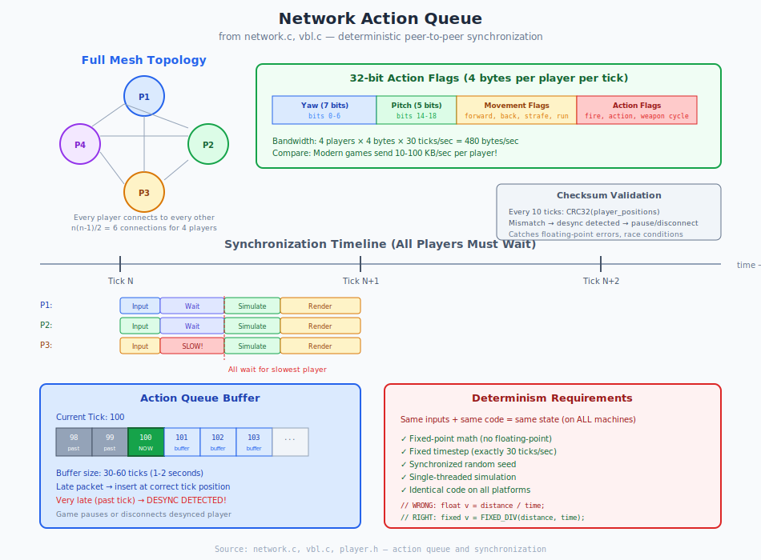

# Chapter 9: Networking Architecture

## Deterministic Peer-to-Peer Multiplayer

> **For Porting:** For single-player, stub out all networking (return from functions early). For multiplayer, replace `network_ddp.c` and `network_adsp.c` with modern sockets/UDP. The core sync logic in `network.c` and `network_games.c` is portable—it just needs a transport layer.

> **Developer Note:** From `physics.c:9-17` (May 1994), explaining the networking design decision:
>
> *"there are two viable methods of running a synchronized network game. the first is doom's, where each player shares with each other player only his control information for that tick (this imposes a maximum frame rate, as the state-of-the-world will be advanced at the same time on all machines). the second is the continuous lag-tolerant model where each player shares absolute information with each other player as often as possible and local machines do their best at guessing what everyone else in the game is doing until they get better information. whichever choice is made will change the physics drastically. we're going to take the latter approach, and cache the KeyMap at interrupt time to be batch-processed later at frame time."*
>
> — Source: `physics.c:9-17`

---

## 9.1 What Problem Are We Solving?

Marathon needs to support multiplayer games where multiple players interact in the same world. This includes:

- **Real-time combat** - Players shooting at each other with minimal lag
- **Consistent world state** - All players see the same thing
- **Limited bandwidth** - 1995 networks were slow (modem, AppleTalk)
- **Varying latency** - Some players have slower connections

**The constraints:**
- Must work over slow networks (28.8 kbps modems)
- Must maintain consistent game state across all machines
- Must handle network lag gracefully
- Must support up to 8 players

**Why not use client-server?**

Traditional client-server networking sends world state from server to clients:

```
Client-Server (high bandwidth):
    Server maintains authoritative world state
    Server → Client: "Monster A is at position (100, 200)"
    Server → Client: "Player B is at position (300, 400)"
    Server → Client: "Projectile C is at position..."

    Problem: Sending entire world state = HIGH bandwidth
    With 512 monsters, 128 projectiles, 8 players...
    Potentially tens of KB per frame!
```

**Marathon's solution: Deterministic Peer-to-Peer**

Instead of sending world state, send only player inputs:

```
Deterministic P2P (low bandwidth):
    Each peer runs IDENTICAL simulation
    Peer → All: "My input this tick: move forward, fire"
    Each peer applies ALL inputs
    Same inputs + same code = same state

    Bandwidth: 4 bytes per player per tick = 480 bytes/sec for 4 players!
```

---

## 9.2 Understanding Deterministic Networking

Before diving into implementation, let's understand why this approach works.

### The Core Concept

```
Traditional Networking (Client-Server):
    Client 1 ──[Position, Actions]──> Server ──[World State]──> Client 1
    Client 2 ──[Position, Actions]──> Server ──[World State]──> Client 2
    Client 3 ──[Position, Actions]──> Server ──[World State]──> Client 3

    Problem: High bandwidth (sending entire world state)
    Advantage: Server is authoritative

Marathon's Deterministic Networking (Peer-to-Peer):
    Peer 1 ──[Input Flags]──> All Peers
    Peer 2 ──[Input Flags]──> All Peers
    Peer 3 ──[Input Flags]──> All Peers

    Each peer:
    1. Collects all inputs for tick N
    2. Runs IDENTICAL simulation with same inputs
    3. Results in IDENTICAL world state (determinism)

    Advantage: Low bandwidth (only inputs)
    Requirement: Bit-identical simulation on all machines
```

### Why Determinism is Critical

The entire system depends on one fact: **given the same inputs, all machines produce the same outputs**.

```
Fixed-Point Mathematics Ensures Determinism:

    Floating Point (NON-deterministic):
        Machine A: 1.0 / 3.0 = 0.33333333333...  (rounded differently)
        Machine B: 1.0 / 3.0 = 0.33333334000...  (slightly different)
        After 1000 operations → positions diverge!

    Fixed-Point (DETERMINISTIC):
        Machine A: 65536 / 3 = 21845  (exact integer division)
        Machine B: 65536 / 3 = 21845  (same result)
        After 1000 operations → positions identical!

    Marathon uses:
        FIXED_ONE = 65536 (16.16 fixed-point)
        All physics calculations use integer math
        Same input + same algorithm = same output
```

### Requirements for Determinism

1. **Fixed-point math** - No floating-point operations
2. **Deterministic random numbers** - Same seed = same sequence
3. **Fixed timestep** - Always exactly 1/30 second per tick
4. **Identical code** - All machines run the same simulation
5. **Synchronized inputs** - All machines process same inputs each tick

---

## 9.3 Peer-to-Peer Architecture

Marathon uses a full mesh topology where every player connects to every other player.

### Network Topology

```
4-Player Game (Full Mesh - every player connects to every other):

          Player 1 ●─────────────────────────● Player 2
                   │╲                       ╱│
                   │ ╲                     ╱ │
                   │  ╲                   ╱  │
                   │   ╲                 ╱   │
                   │    ╲               ╱    │
                   │     ╲             ╱     │
                   │      ╲           ╱      │
                   │       ╲         ╱       │
                   │        ╲       ╱        │
                   │         ╲     ╱         │
                   │          ╲   ╱          │
                   │           ╲ ╱           │
                   │            ╳            │  ← All paths cross (X-shape)
                   │           ╱ ╲           │
                   │          ╱   ╲          │
                   │         ╱     ╲         │
                   │        ╱       ╲        │
                   │       ╱         ╲       │
                   │      ╱           ╲      │
                   │     ╱             ╲     │
                   │    ╱               ╲    │
                   │   ╱                 ╲   │
                   │  ╱                   ╲  │
                   │ ╱                     ╲ │
                   │╱                       ╲│
          Player 4 ●─────────────────────────● Player 3

Connection Count:
  P1 ↔ P2, P1 ↔ P3, P1 ↔ P4  (3 connections from P1)
  P2 ↔ P3, P2 ↔ P4            (2 new connections from P2)
  P3 ↔ P4                      (1 new connection from P3)
  Total: 6 bidirectional connections = n(n-1)/2 for n=4 players

Each player broadcasts to all others (no central server)
All peers are equal
Maximum 8 players → 28 connections
```

### Why Peer-to-Peer?

**Advantages:**
- No single point of failure (no server)
- Lower latency (direct connections)
- Simpler hosting (any player can start)

**Disadvantages:**
- Bandwidth scales with player count (n² connections)
- Harder to prevent cheating
- All players must maintain good connections

### Action Flags Structure

```c
struct action_flags {
    long flags;            // Compressed input (32 bits)
    short tick;            // Which tick
    short player_index;
};
```

---

## 9.4 The Synchronization Loop

Each tick, all machines must agree on inputs before advancing the simulation.

### Per-Frame Process

```
Tick N begins:

Player 1's Machine:
    ┌─────────────────────────────────────┐
    │ 1. Read local input (keyboard/mouse)│
    │    → Generate action_flags          │
    │                                     │
    │ 2. Broadcast to all peers:          │
    │    send(action_flags, tick=N, p=1)  │
    │                                     │
    │ 3. Wait for all other players:      │
    │    recv(action_flags, tick=N, p=2)  │
    │    recv(action_flags, tick=N, p=3)  │
    │    recv(action_flags, tick=N, p=4)  │
    │                                     │
    │ 4. ALL inputs for tick N ready!     │
    │                                     │
    │ 5. Run game logic for 1 tick:       │
    │    update_players(all_actions)      │
    │    move_projectiles()               │
    │    move_monsters()                  │
    │    physics_update()                 │
    │                                     │
    │ 6. World state now at tick N+1      │
    │                                     │
    │ 7. Render current state             │
    └─────────────────────────────────────┘

Player 2's Machine:
    [IDENTICAL PROCESS]
    Same inputs → Same simulation → Same result

Player 3's Machine:
    [IDENTICAL PROCESS]

Player 4's Machine:
    [IDENTICAL PROCESS]
```

### Timeline Diagram

```
Time →
Tick:      N              N+1            N+2            N+3

Player 1: [Input] [Wait] [Sim] [Render] [Input] [Wait] [Sim]...
Player 2: [Input] [Wait] [Sim] [Render] [Input] [Wait] [Sim]...
Player 3: [Input] [Wait] [Sim] [Render] [Input] [Wait] [Sim]...
Player 4: [Input] [Wait] [Sim] [Render] [Input] [Wait] [Sim]...

[Wait] = Waiting for all players' inputs
[Sim]  = Running deterministic simulation
[Render] = Drawing frame (can be faster than 30Hz)

All machines stay synchronized at tick boundaries
```



---

## 9.5 Lag Tolerance and Queue Buffering

Network delays are handled through input buffering.

### Input Queue System

```
Each player maintains a queue of future actions:

Current Tick: 100

Action Queue (buffered ahead):
┌─────┬─────┬─────┬─────┬─────┬─────┬─────┐
│ 98  │ 99  │ 100 │ 101 │ 102 │ 103 │ 104 │ ← Tick numbers
└─────┴─────┴─────┴─────┴─────┴─────┴─────┘
  Past  Past  Now!  Buffered future actions

Buffer Size: 1-2 seconds (30-60 ticks)

If late packet arrives:
    - Tick 101 action arrives while we're at tick 100
    - Insert into queue at correct position
    - Simulation continues normally

If very late packet arrives:
    - Tick 99 action arrives while we're at tick 100
    - Already simulated!
    - DESYNC DETECTED!
    - Game may pause or disconnect
```

### Handling Network Delays

```
Scenario: Player 3 has high ping

Tick 50:
    Player 1: Send input for tick 50 ─────┐
    Player 2: Send input for tick 50 ─────┼───> All arrive at tick 50
    Player 3: Send input for tick 50 ─────┘ (delayed)
              ↓
              ↓ (traveling over network)
              ↓
Tick 51:      ↓
    Player 1, 2: WAITING for Player 3's tick 50 input
    Player 3's packet arrives!

    All machines now have inputs for tick 50
    Simulation proceeds

Game feels "laggy" but stays synchronized
All players see the same world
```

### The Cost of Waiting

When one player has high latency, ALL players experience lag:

```
Latency Impact:

Player 1: 20ms ping  ─┐
Player 2: 25ms ping  ─┼─► Game runs at speed of SLOWEST player
Player 3: 150ms ping ─┘   All players see 150ms input delay!

This is the fundamental tradeoff of deterministic networking:
    ✓ Perfect consistency (no desyncs)
    ✗ Latency affects everyone
```

---

## 9.6 Why Fixed Timestep is Critical

Variable timestep would break determinism immediately.

### The Problem with Variable Timestep

```
Variable Timestep (BREAKS determinism):
    Machine A: Fast CPU
        Tick 1: dt = 0.016s → physics_update(0.016)
        Tick 2: dt = 0.017s → physics_update(0.017)

    Machine B: Slow CPU
        Tick 1: dt = 0.033s → physics_update(0.033)
        Tick 2: dt = 0.034s → physics_update(0.034)

    Result: Different physics! Desync!

Fixed Timestep (ENSURES determinism):
    All Machines:
        Tick 1: physics_update(1/30)  ← Always exactly 1/30 second
        Tick 2: physics_update(1/30)
        Tick 3: physics_update(1/30)

    Result: Identical physics! Stays in sync!
```

### Deterministic Random Numbers

Marathon synchronizes random number generation:

```
Deterministic Random (Marathon's approach):

    Seed synchronized at game start:
        All players: random_seed = 12345

    During gameplay:
        Player 1: random() → 8472  (using seed 12345)
        Player 2: random() → 8472  (using same seed 12345)
        Player 3: random() → 8472  (identical!)

        Next call:
        Player 1: random() → 2391
        Player 2: random() → 2391
        Player 3: random() → 2391

    All random events (damage, spread, etc.) are identical!

Non-deterministic Random (would break):
    Player 1: random() → based on CPU timer → 1234
    Player 2: random() → based on CPU timer → 8876
    Player 3: random() → based on CPU timer → 4429

    Desync immediately!
```

---

## 9.7 Action Flags Compression

All player input is compressed into 32 bits for efficient transmission.

### Bit Layout

```
32-bit Action Flags:

Bits 0-6:   Absolute yaw (7 bits)        → 128 angles
Bits 7-13:  Reserved/flags (7 bits)
Bits 14-18: Absolute pitch (5 bits)      → 32 angles
Bits 19-21: Reserved/flags (3 bits)
Bits 22-28: Absolute position (7 bits)   → Position encoding
Bits 29-31: Movement flags (3 bits)
```

### Individual Flags

```c
_turning_left, _turning_right
_looking_left, _looking_right, _looking_up, _looking_down, _looking_center
_moving_forward, _moving_backward
_sidestepping_left, _sidestepping_right
_run_dont_walk
_left_trigger_state, _right_trigger_state
_action_trigger_state
_cycle_weapons_forward, _cycle_weapons_backward
_toggle_map, _swim
```

### Bandwidth Calculation

```
Result: Entire player input in just 32 bits = 4 bytes per player per tick

Bandwidth: 4 players × 4 bytes × 30 ticks/sec = 480 bytes/sec
           (Plus overhead, ~1-2 KB/sec total)

Compare to modern games: 10-100 KB/sec per player!
```

---

## 9.8 Checksum Validation

Periodic checksums detect desyncs before they cause problems.

### How Checksums Work

```
Periodic Position Checksum (every 10 ticks):

Tick 100:
    Player 1 calculates: CRC32(all_player_positions) = 0xABCD1234
    Player 1 sends: checksum = 0xABCD1234

Tick 100:
    Player 2 calculates: CRC32(all_player_positions) = 0xABCD1234
    Player 2 sends: checksum = 0xABCD1234

Tick 100:
    Player 3 calculates: CRC32(all_player_positions) = 0xFFFF9999  ← Different!
    Player 3 sends: checksum = 0xFFFF9999

Tick 101:
    All players receive checksums
    Player 1: "My checksum matches Player 2, but not Player 3"
    Player 2: "My checksum matches Player 1, but not Player 3"
    Player 3: "I don't match anyone!"

    DESYNC DETECTED!

    Options:
    - Pause game and warn players
    - Disconnect desynced player
    - Attempt resynchronization
```

### Common Desync Causes

```
Common Causes:
1. Floating-point math used somewhere (breaks determinism)
2. Uninitialized memory read (random values)
3. Platform-specific behavior (different compilers)
4. Race conditions in code
5. Save/load corrupting state

Marathon's Solutions:
1. ✓ No floating-point math (all fixed-point)
2. ✓ Careful initialization
3. ✓ Same codebase on all platforms
4. ✓ Single-threaded simulation
5. ✓ Checksums verify state consistency
```

---

## 9.9 Network Loop Implementation

### High-Level Pseudocode

```c
void network_game_loop() {
    while (game_running) {
        // 1. Get local player input
        action_flags local_input = get_player_input();
        local_input.tick = current_tick;
        local_input.player_index = local_player_index;

        // 2. Broadcast to all peers
        for (each peer) {
            send_packet(peer, &local_input);
        }

        // 3. Wait for all peer inputs
        action_flags all_inputs[MAX_PLAYERS];
        all_inputs[local_player_index] = local_input;

        for (each remote player) {
            receive_packet(remote_player, &all_inputs[remote_player]);

            // Verify tick number matches
            if (all_inputs[remote_player].tick != current_tick) {
                // Handle late/early packet
                handle_timing_issue();
            }
        }

        // 4. ALL inputs collected, advance simulation
        update_world_one_tick(all_inputs);

        // 5. Increment tick counter
        current_tick++;

        // 6. Render current state (can be faster than 30Hz)
        render_frame();
    }
}
```

### Lag Tolerance

- Queue buffers 1-2 seconds
- Late arrivals caught up
- Game waits for slowest player

---

## 9.10 Desync Prevention Checklist

For porting, ensure these rules are followed:

**Required for Determinism:**

| Rule | Marathon Implementation |
|------|------------------------|
| No floating-point | All math uses fixed-point (16.16 format) |
| Fixed timestep | Exactly 30 ticks per second |
| Deterministic random | Synchronized seed at game start |
| Same code path | All platforms run identical simulation |
| Single-threaded | No race conditions in game logic |
| Careful initialization | All variables initialized before use |

**Common Porting Mistakes:**

```c
// WRONG - Non-deterministic!
float velocity = distance / time;  // Floating-point varies by platform

// CORRECT - Deterministic!
fixed velocity = FIXED_DIV(distance, time);  // Integer division is exact

// WRONG - Non-deterministic!
int r = rand();  // System random is unpredictable

// CORRECT - Deterministic!
int r = marathon_random();  // Synchronized pseudo-random
```

---

## 9.11 Summary

Marathon's networking uses deterministic peer-to-peer synchronization:

**Core Principle:**
- Send inputs, not state
- All machines run identical simulation
- Same inputs → same outputs

**Key Techniques:**
- Fixed-point math for determinism
- 32-bit action flags for compression
- Input queuing for lag tolerance
- Checksums for desync detection

**Advantages:**
- Very low bandwidth (480 bytes/sec for 4 players)
- Perfect consistency across all machines
- Works on slow 1995 networks

**Trade-offs:**
- Latency affects all players equally
- Requires bit-identical simulation
- No authoritative server (harder to prevent cheating)

### Key Constants

| Constant | Value | Purpose |
|----------|-------|---------|
| `MAXIMUM_PLAYERS` | 8 | Player limit |
| `TICKS_PER_SECOND` | 30 | Update rate |
| Action flags | 32 bits | Input encoding |
| Checksum frequency | 10 ticks | Desync detection |

### Key Source Files

| File | Purpose |
|------|---------|
| `network.c` | Core networking logic |
| `network_games.c` | Game mode networking |
| `network_ddp.c` | AppleTalk DDP transport (replace) |
| `network_adsp.c` | AppleTalk ADSP transport (replace) |
| `vbl.c` | Action queue management |

### Source Reference Summary

| Function/Structure | Location |
|-------------------|----------|
| Action flag macros | player.h |
| `update_world()` | marathon2.c |
| Network packet handling | network.c |
| Action queue | vbl.c |

---

## 9.12 For Modern Porting

When porting Marathon's networking to modern platforms:

**Replace Transport Layer:**
- Replace AppleTalk with UDP sockets
- Implement reliable and unreliable packet types
- Handle NAT traversal if needed

**Keep Sync Logic:**
- The core synchronization in `network.c` is portable
- Action flag encoding/decoding is portable
- Checksum validation is portable

**Single-Player First:**
- Stub out networking to get single-player working
- Add multiplayer after core game is stable
- Test determinism with replay system first

---

*This completes the Game Systems section. The core Marathon engine documentation is now complete.*

*Next planned: [Chapter 10: File Formats](10_file_formats.md) - WAD files, shapes, and sounds*
