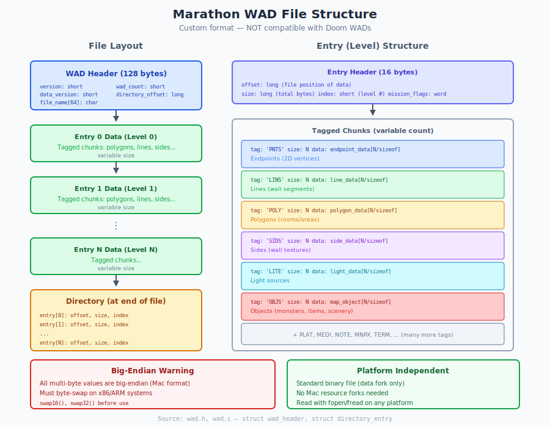

# Chapter 10: File Formats

## WAD Files, Shapes, and Sounds

> **Source files**: `wad.h`, `wad.c`, `tags.h`, `shape_definitions.h`, `collection_definition.h`, `shapes.c`
> **Related chapters**: [Chapter 19: Shapes](19_shapes.md), [Appendix K: Save Game Format](appendix_k_savegame_format.md), [Appendix L: Shapes Format](appendix_l_shapes_format.md)

> **For Porting:** Great news! All game data files (Maps, Shapes, Sounds) are readable with standard `fopen()`/`fread()`. Replace `FSSpec`/`FSRead` with stdio in `wad.c`, `game_wad.c`. Add byte swapping (files are big-endian, x86 is little-endian). Only the optional Images file uses Mac resource forks.

---

## 10.1 What Problem Are We Solving?

Marathon needs to load and store large amounts of game data efficiently:

- **Map geometry** - Polygons, lines, vertices, platforms
- **Textures and sprites** - Wall textures, monster animations, item graphics
- **Sound effects** - Weapons, monsters, ambient sounds
- **Saved games** - Complete world state restoration

**The constraints:**
- Must load quickly from 1995 hard drives
- Must minimize memory footprint
- Must support modular level packs
- Must save/restore exact game state

**Marathon's solution: Custom Binary Formats**

Marathon uses purpose-built binary formats optimized for the game engine. Despite being Mac software, the core data files use **standard binary formats** readable on any platform—only interface graphics use Mac resource forks.

---

## 10.2 Understanding Marathon's File Types

Before diving into formats, let's understand what files Marathon uses.

### File Type Constants (`tags.h:16-23`)

```c
#define APPLICATION_CREATOR '26.∞'
#define SCENARIO_FILE_TYPE 'sce2'
#define SAVE_GAME_TYPE 'sga∞'
#define FILM_FILE_TYPE 'fil∞'
#define PHYSICS_FILE_TYPE 'phy∞'
#define SHAPES_FILE_TYPE 'shp∞'
#define SOUNDS_FILE_TYPE 'snd∞'
#define PATCH_FILE_TYPE 'pat2'
```

### File Categories

| File Type | Format | Readable on All Platforms? |
|-----------|--------|---------------------------|
| Map files | Marathon WAD | Yes - standard `fopen`/`fread` |
| Shapes (Shapes8/16) | Data fork binary | Yes - standard `fopen`/`fread` |
| Sounds (Sounds8/16) | Data fork binary | Yes - standard `fopen`/`fread` |
| Images | Mac resource fork | No - needs extraction or stub |

**Key insight**: The core game data (shapes, sounds, maps) is all in standard binary formats. Only optional interface graphics use Mac-specific resource forks.

---

## 10.3 Marathon WAD Format

Marathon uses its own WAD format for maps—**NOT** Doom WADs despite the similar name.

### WAD Version Constants (`wad.h:13-23`)

```c
#define PRE_ENTRY_POINT_WADFILE_VERSION 0
#define WADFILE_HAS_DIRECTORY_ENTRY 1
#define WADFILE_SUPPORTS_OVERLAYS 2
#define CURRENT_WADFILE_VERSION (WADFILE_SUPPORTS_OVERLAYS)

// Infinity versions
#define INFINITY_WADFILE_VERSION (CURRENT_WADFILE_VERSION+2)  // Version 4
```

### WAD Limits (`wad.h:25-28`)

```c
#define MAXIMUM_DIRECTORY_ENTRIES_PER_FILE 64
#define MAXIMUM_WADFILE_NAME_LENGTH 64
#define MAXIMUM_UNION_WADFILES 16
#define MAXIMUM_OPEN_WADFILES 3
```

### WAD File Structure

```
┌─────────────────────────────────────────────────────────────────┐
│                    WAD FILE STRUCTURE                           │
├─────────────────────────────────────────────────────────────────┤
│                                                                 │
│  ┌───────────────────────────────────────────────────────────┐  │
│  │            WAD HEADER (128 bytes)                         │  │
│  │  ├─ version, data_version                                 │  │
│  │  ├─ file_name[64]                                         │  │
│  │  ├─ checksum (CRC32)                                      │  │
│  │  ├─ directory_offset ─────────────────────────────┐       │  │
│  │  ├─ wad_count (number of levels)                  │       │  │
│  │  └─ parent_checksum (for patches)                 │       │  │
│  └───────────────────────────────────────────────────│───────┘  │
│                                                      │          │
│  ┌───────────────────────────────────────────────────│───────┐  │
│  │         LEVEL DATA (repeated per level)           │       │  │
│  │                                                   │       │  │
│  │  [Entry Header] tag='PNTS' length=N              │       │  │
│  │  [Point Data - N bytes]                          │       │  │
│  │                                                   │       │  │
│  │  [Entry Header] tag='LINS' length=M              │       │  │
│  │  [Line Data - M bytes]                           │       │  │
│  │                                                   │       │  │
│  │  [Entry Header] tag='SIDS' length=...            │       │  │
│  │  [Side Data]                                     │       │  │
│  │                                                   │       │  │
│  │  [Entry Header] tag='POLY' length=...            │       │  │
│  │  [Polygon Data]                                  │       │  │
│  │                                                   │       │  │
│  │  ... more tagged entries ...                     │       │  │
│  └───────────────────────────────────────────────────│───────┘  │
│                                                      │          │
│  ┌───────────────────────────────────────────────────▼───────┐  │
│  │         DIRECTORY (at directory_offset)                   │  │
│  │                                                           │  │
│  │  [Directory Entry 0] offset, length, index=0              │  │
│  │  [Directory Entry 1] offset, length, index=1              │  │
│  │  ... one per level ...                                    │  │
│  └───────────────────────────────────────────────────────────┘  │
│                                                                 │
└─────────────────────────────────────────────────────────────────┘
```



### WAD Header Structure (`wad.h:36-48`)

```c
struct wad_header { /* 128 bytes */
    short version;                              /* Used internally */
    short data_version;                         /* Used by the data.. */
    char file_name[MAXIMUM_WADFILE_NAME_LENGTH]; /* 64 bytes */
    unsigned long checksum;
    long directory_offset;
    short wad_count;
    short application_specific_directory_data_size;
    short entry_header_size;
    short directory_entry_base_size;
    unsigned long parent_checksum;  /* If non-zero, this is a patch file */
    short unused[20];
};
```

### Directory Entry Structure (`wad.h:55-59`)

```c
struct directory_entry { /* 10 bytes */
    long offset_to_start;  /* From start of file */
    long length;           /* Of total level */
    short index;           /* For inplace modification of the wadfile! */
};
```

### Entry Header Structure (`wad.h:71-80`)

```c
struct entry_header { /* 16 bytes */
    WadDataType tag;
    long next_offset;  /* From current file location */
    long length;       /* Of entry */
    long offset;       /* Offset for inplace expansion of data */

    /* Data follows */
};
```

**Note**: `WadDataType` is defined as `unsigned long` (`wad.h:33`).

### In-Memory WAD Structure (`wad.h:91-96`)

```c
struct wad_data {
    short tag_count;            /* Tag count */
    short padding;
    byte *read_only_data;       /* If non NULL, we are read only */
    struct tag_data *tag_data;  /* Tag data array */
};
```

### Tag Types

**Map/Level Tags** (`tags.h:26-42`):

| Tag | FourCC | Description |
|-----|--------|-------------|
| `POINT_TAG` | `'PNTS'` | Vertex points |
| `LINE_TAG` | `'LINS'` | Line segments |
| `SIDE_TAG` | `'SIDS'` | Side definitions |
| `POLYGON_TAG` | `'POLY'` | Polygon data |
| `LIGHTSOURCE_TAG` | `'LITE'` | Light sources |
| `ANNOTATION_TAG` | `'NOTE'` | Map annotations |
| `OBJECT_TAG` | `'OBJS'` | Object placement |
| `GUARDPATH_TAG` | `'påth'` | Monster patrol paths |
| `MAP_INFO_TAG` | `'Minf'` | Map info |
| `ITEM_PLACEMENT_STRUCTURE_TAG` | `'plac'` | Item placement |
| `PLATFORM_STATIC_DATA_TAG` | `'plat'` | Platforms |
| `ENDPOINT_DATA_TAG` | `'EPNT'` | Endpoint data |
| `MEDIA_TAG` | `'medi'` | Media (liquids) |
| `AMBIENT_SOUND_TAG` | `'ambi'` | Ambient sounds |
| `RANDOM_SOUND_TAG` | `'bonk'` | Random sounds |
| `TERMINAL_DATA_TAG` | `'term'` | Terminal text |

**Save/Load Game Tags** (`tags.h:45-57`):

| Tag | FourCC | Description |
|-----|--------|-------------|
| `PLAYER_STRUCTURE_TAG` | `'plyr'` | Player data |
| `DYNAMIC_STRUCTURE_TAG` | `'dwol'` | Dynamic world state |
| `OBJECT_STRUCTURE_TAG` | `'mobj'` | Object instances |
| `MAP_INDEXES_TAG` | `'iidx'` | Map indexes |
| `AUTOMAP_LINES` | `'alin'` | Automap lines |
| `AUTOMAP_POLYGONS` | `'apol'` | Automap polygons |
| `MONSTERS_STRUCTURE_TAG` | `'mOns'` | Monster states |
| `EFFECTS_STRUCTURE_TAG` | `'fx  '` | Active effects |
| `PROJECTILES_STRUCTURE_TAG` | `'bang'` | Active projectiles |
| `PLATFORM_STRUCTURE_TAG` | `'PLAT'` | Platform states |
| `WEAPON_STATE_TAG` | `'weap'` | Weapon states |
| `TERMINAL_STATE_TAG` | `'cint'` | Terminal progress |

**Physics Tags** (`tags.h:60-64`):

| Tag | FourCC | Description |
|-----|--------|-------------|
| `MONSTER_PHYSICS_TAG` | `'MNpx'` | Monster definitions |
| `EFFECTS_PHYSICS_TAG` | `'FXpx'` | Effect definitions |
| `PROJECTILE_PHYSICS_TAG` | `'PRpx'` | Projectile definitions |
| `PHYSICS_PHYSICS_TAG` | `'PXpx'` | Player physics |
| `WEAPONS_PHYSICS_TAG` | `'WPpx'` | Weapon definitions |

### Reading a WAD File

```c
// Modern C implementation
FILE* fp = fopen("Map.wad", "rb");

// Read header
struct wad_header header;
fread(&header, sizeof(header), 1, fp);

// Byte swap on little-endian systems
header.version = swap16(header.version);
header.wad_count = swap16(header.wad_count);
header.directory_offset = swap32(header.directory_offset);

// Seek to directory
fseek(fp, header.directory_offset, SEEK_SET);

// Read directory entries
for (int i = 0; i < header.wad_count; i++) {
    struct directory_entry entry;
    fread(&entry, sizeof(entry), 1, fp);

    // Byte swap
    entry.offset_to_start = swap32(entry.offset_to_start);
    entry.length = swap32(entry.length);

    // Now seek to entry.offset_to_start to read level data
}
```

---

## 10.4 Shape Files

Shape files contain all textures and sprites. Despite Marathon being a Mac game, shapes are stored in **standard data fork** as binary files.

> **For complete byte-level specification**: See [Appendix L: Shapes Format](appendix_l_shapes_format.md)

### Collection Header (`shape_definitions.h:8-26`)

```c
struct collection_header /* 32 bytes */
{
    short status;
    word flags;

    long offset, length;      /* 8-bit collection data */
    long offset16, length16;  /* 16-bit collection data */

#ifdef mac
    struct collection_definition **collection;  /* Runtime handle */
    void **shading_tables;                      /* Runtime handle */
    short unused[2];
#endif

#ifdef win
    short unused[6];
#endif
};
```

**Global storage** (`shape_definitions.h:79`):
```c
static struct collection_header collection_headers[MAXIMUM_COLLECTIONS];
```

### Byte Swap Specification (`shape_definitions.h:30-34`)

```c
static _bs_field _bs_collection_header[]=
{
    _2byte, _2byte, _4byte, _4byte, _4byte, _4byte,
    _4byte, _4byte, _2byte, _2byte
};
```

### Reading a Shape File

```c
FILE* fp = fopen("Shapes16", "rb");

// Read collection headers (32 entries × 32 bytes = 1024 bytes)
struct collection_header headers[32];
fread(&headers, sizeof(struct collection_header), 32, fp);

// Byte swap (big-endian to little-endian)
for (int i = 0; i < 32; i++) {
    headers[i].offset16 = swap32(headers[i].offset16);
    headers[i].length16 = swap32(headers[i].length16);
}

// Load collection #5 at 16-bit
fseek(fp, headers[5].offset16, SEEK_SET);
byte* data = malloc(headers[5].length16);
fread(data, headers[5].length16, 1, fp);
```

### Collection Definition (`collection_definition.h:36-60`)

```c
#define COLLECTION_VERSION 3  /* collection_definition.h:22 */

struct collection_definition
{
    short version;

    short type;  /* used for get_shape_descriptors() */
    word flags;  /* [unused.16] */

    short color_count, clut_count;
    long color_table_offset;  /* array of clut_count × color_count ColorSpec */

    short high_level_shape_count;
    long high_level_shape_offset_table_offset;

    short low_level_shape_count;
    long low_level_shape_offset_table_offset;

    short bitmap_count;
    long bitmap_offset_table_offset;

    short pixels_to_world;  /* used to shift pixel values into world coordinates */

    long size;  /* used to assert offsets */

    short unused[253];
};
```

### Collection Types (`collection_definition.h:27-34`)

```c
enum /* collection types */
{
    _unused_collection= 0,    /* raw */
    _wall_collection,         /* raw */
    _object_collection,       /* rle */
    _interface_collection,    /* raw */
    _scenery_collection       /* rle */
};
```

### Shape Hierarchy

```
Collection (e.g., "Hunter" collection)
    │
    ├─► High-Level Shapes (animations)
    │     │
    │     ├─► "Walking" (8 views × 12 frames)
    │     ├─► "Attacking" (8 views × 6 frames)
    │     ├─► "Dying" (1 view × 8 frames)
    │     └─► ...
    │
    ├─► Low-Level Shapes (individual frames)
    │     │
    │     ├─► Frame 0: bitmap 5, origin (32, 64)
    │     ├─► Frame 1: bitmap 5, origin (33, 65), mirrored
    │     └─► ...
    │
    └─► Bitmaps (pixel data)
          │
          ├─► Bitmap 0: 64×128, RLE compressed
          ├─► Bitmap 1: 64×128, RLE compressed
          └─► ...
```

### High-Level Shape Definition (`collection_definition.h:66-91`)

```c
#define HIGH_LEVEL_SHAPE_NAME_LENGTH 32  /* collection_definition.h:64 */

struct high_level_shape_definition
{
    short type;  /* ==0 */
    word flags;  /* [unused.16] */

    char name[HIGH_LEVEL_SHAPE_NAME_LENGTH+1];  /* 33 bytes */

    short number_of_views;

    short frames_per_view, ticks_per_frame;
    short key_frame;

    short transfer_mode;
    short transfer_mode_period;  /* in ticks */

    short first_frame_sound, key_frame_sound, last_frame_sound;

    short pixels_to_world;

    short loop_frame;

    short unused[14];

    /* number_of_views*frames_per_view indexes of low-level shapes follow */
    short low_level_shape_indexes[1];
};
```

### Low-Level Shape Definition (`collection_definition.h:99-117`)

```c
struct low_level_shape_definition
{
    word flags;  /* [x-mirror.1] [y-mirror.1] [keypoint_obscured.1] [unused.13] */

    fixed minimum_light_intensity;  /* in [0,FIXED_ONE] */

    short bitmap_index;

    /* (x,y) in pixel coordinates of origin */
    short origin_x, origin_y;

    /* (x,y) in pixel coordinates of key point */
    short key_x, key_y;

    short world_left, world_right, world_top, world_bottom;
    short world_x0, world_y0;

    short unused[4];
};
```

### Shape Flags (`collection_definition.h:95-97`)

```c
#define _X_MIRRORED_BIT 0x8000
#define _Y_MIRRORED_BIT 0x4000
#define _KEYPOINT_OBSCURED_BIT 0x2000
```

### Color Tables (`collection_definition.h:121-132`)

```c
enum
{
    SELF_LUMINESCENT_COLOR_FLAG= 0x80
};

struct rgb_color_value
{
    byte flags;
    byte value;

    word red, green, blue;
};
```

**Private colors reserved** (`collection_definition.h:25`):
```c
#define NUMBER_OF_PRIVATE_COLORS 3
```

---

## 10.5 Byte Order Considerations

All Marathon data is **big-endian** (Mac byte order). On little-endian systems (x86, ARM), byte swapping is required.

### Byte Swap Specifications

Marathon defines byte swap patterns for all structures (`shape_definitions.h:30-75`):

```c
// Collection header byte swap (shape_definitions.h:30-34)
static _bs_field _bs_collection_header[]= {
    _2byte, _2byte, _4byte, _4byte, _4byte, _4byte,
    _4byte, _4byte, _2byte, _2byte
};

// Collection definition byte swap (shape_definitions.h:36-41)
static _bs_field _bs_collection_definition[]= {
    _2byte, _2byte, _2byte, _2byte, _2byte, _4byte,
    _2byte, _4byte, _2byte, _4byte, _2byte, _4byte,
    _2byte, _4byte, 253*sizeof(short)
};

// High-level shape byte swap (shape_definitions.h:43-51)
static _bs_field _bs_high_level_shape_definition[]= {
    _2byte, _2byte, HIGH_LEVEL_SHAPE_NAME_LENGTH+1, _2byte,
    _2byte, _2byte, _2byte, _2byte, _2byte,
    _2byte, _2byte, _2byte,
    _2byte, _2byte,
    14*sizeof(short),
    sizeof(short)  // byte-swapped later
};

// Low-level shape byte swap (shape_definitions.h:53-61)
static _bs_field _bs_low_level_shape_definition[]= {
    _2byte, _4byte, _2byte,
    _2byte, _2byte,
    _2byte, _2byte,
    _2byte, _2byte, _2byte, _2byte,
    _2byte, _2byte,
    4*sizeof(short)
};

// RGB color value byte swap (shape_definitions.h:71-75)
static _bs_field _bs_rgb_color_value[]= {
    2*sizeof(byte),
    _2byte, _2byte, _2byte
};
```

### Detecting Byte Order

At compile time, detect if byte swapping is needed:

```c
// Method 1: Use standard macros (POSIX)
#include <endian.h>  // Linux
// or <machine/endian.h> on macOS

#if __BYTE_ORDER == __LITTLE_ENDIAN
    #define MARATHON_NEEDS_SWAP 1
#else
    #define MARATHON_NEEDS_SWAP 0
#endif

// Method 2: Compiler-specific (most reliable)
#if defined(__LITTLE_ENDIAN__) || defined(_M_IX86) || defined(_M_X64) || \
    defined(__x86_64__) || defined(__i386__) || defined(__aarch64__)
    #define MARATHON_NEEDS_SWAP 1
#else
    #define MARATHON_NEEDS_SWAP 0
#endif
```

### Byte Swap Functions

**Option A: Custom swap functions (portable):**

```c
uint16_t swap16(uint16_t val) {
    return (val << 8) | (val >> 8);
}

uint32_t swap32(uint32_t val) {
    return ((val & 0xFF) << 24) |
           ((val & 0xFF00) << 8) |
           ((val & 0xFF0000) >> 8) |
           ((val & 0xFF000000) >> 24);
}
```

**Option B: Standard hton/ntoh functions (POSIX):**

```c
#include <arpa/inet.h>  // POSIX (Linux, macOS)
// or <winsock2.h> on Windows

// Since Marathon data IS big-endian (network order):
header.version = ntohs(header.version);           // 16-bit
header.directory_offset = ntohl(header.directory_offset);  // 32-bit
```

**Option C: Compiler intrinsics (fastest):**

```c
// GCC/Clang
#define swap16(x) __builtin_bswap16(x)
#define swap32(x) __builtin_bswap32(x)

// MSVC
#include <stdlib.h>
#define swap16(x) _byteswap_ushort(x)
#define swap32(x) _byteswap_ulong(x)
```

### Conditional Swap Macros

```c
#if MARATHON_NEEDS_SWAP
    #define BE16(x) swap16(x)
    #define BE32(x) swap32(x)
#else
    #define BE16(x) (x)  // No swap needed on big-endian
    #define BE32(x) (x)
#endif

// Usage when loading
header.version = BE16(header.version);
header.directory_offset = BE32(header.directory_offset);
```

### When to Swap

| Field Size | Swap Function | Examples |
|------------|---------------|----------|
| 1 byte (byte, char) | No swap needed | flags, pixel indices |
| 2 bytes (short, word) | `BE16()` / `ntohs()` | version, count fields |
| 4 bytes (long, fixed) | `BE32()` / `ntohl()` | offsets, fixed-point coords |

---

## 10.6 Summary

Marathon's file formats are well-structured and portable:

**Marathon WAD Files:**
- Header → Level Data → Directory
- Tagged entries for each data type
- Custom format (NOT Doom WADs)

**Shape Files:**
- 32 collection slots
- Three-level hierarchy: High-Level → Low-Level → Bitmap
- RLE compression for sprites
- Palette-based colors

**Porting Strategy:**
- Replace Mac file APIs with `fopen`/`fread`
- Add byte swapping for little-endian systems
- Convert colors during load (8-bit palette → 32-bit ARGB)

### Key Constants

| Constant | Value | Source |
|----------|-------|--------|
| `MAXIMUM_COLLECTIONS` | 32 | `shape_definitions.h:79` |
| `MAXIMUM_DIRECTORY_ENTRIES_PER_FILE` | 64 | `wad.h:25` |
| `MAXIMUM_WADFILE_NAME_LENGTH` | 64 | `wad.h:26` |
| `COLLECTION_VERSION` | 3 | `collection_definition.h:22` |
| `HIGH_LEVEL_SHAPE_NAME_LENGTH` | 32 | `collection_definition.h:64` |
| WAD header size | 128 bytes | `wad.h:36` |
| Entry header size | 16 bytes | `wad.h:71` |
| Directory entry size | 10 bytes | `wad.h:55` |
| Collection header size | 32 bytes | `shape_definitions.h:8` |

### Key Source Files

| File | Purpose |
|------|---------|
| `wad.h` | WAD structure definitions |
| `wad.c` | WAD file reading/writing |
| `tags.h` | All WAD tag definitions |
| `shape_definitions.h` | Collection header, byte swap specs |
| `collection_definition.h` | Shape structure definitions |
| `shapes.c` | Shape loading and management |
| `game_wad.c` | Game-specific WAD handling |

---

## 10.7 See Also

- [Chapter 19: Shapes](19_shapes.md) — Shape loading and shading tables
- [Appendix G: Physics File Format](appendix_g_physics_file.md) — Physics WAD tags
- [Appendix H: Film Format](appendix_h_film_format.md) — Recording file format
- [Appendix K: Save Game Format](appendix_k_savegame_format.md) — Save game structure
- [Appendix L: Shapes Format](appendix_l_shapes_format.md) — Byte-level shape parsing

---

*Next: [Chapter 11: Performance and Optimization](11_performance.md) - Inner loops and optimization strategies*
