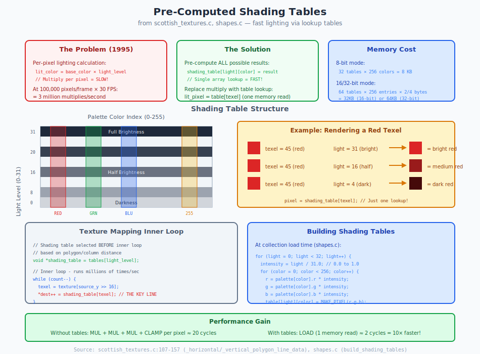

# Chapter 19: Shape Animation System

## Sprites, Collections, and Animation Playback

> **For Porting:** Replace `shapes_macintosh.c` with code that reads shape collections from the binary Shapes file using `fopen()`/`fread()`. The data structures in `shapes.c` and `shapes.h` are portable. Convert 8-bit palette colors to 32-bit ARGB during load time.

---

## 19.1 What Problem Are We Solving?

Marathon needs to display:

- **Monsters** - 47 types with walking, attacking, dying animations
- **Weapons** - First-person hands and gun sprites
- **Items** - Pickups scattered around levels
- **Effects** - Explosions, projectiles, debris
- **Textures** - Wall and floor surfaces

All must support multiple viewing angles and smooth animation.

---

## 19.2 Collection Index

Marathon organizes graphics into **32 collections**:

| ID | Name | Contents |
|----|------|----------|
| 0 | `_collection_interface` | HUD, menus |
| 1 | `_collection_weapons_in_hand` | First-person weapons |
| 2-16 | Monster collections | Individual enemy sprites |
| 17-21 | `_collection_walls1-5` | Wall textures by environment |
| 22-26 | `_collection_scenery1-5` | Scenery sprites |
| 27-30 | `_collection_landscape1-4` | Sky/horizon textures |
| 31 | `_collection_cyborg` | Cyborg sprites |

---

## 19.3 Collection Types

From `collection_definition.h:27-34`:
```c
enum {
    _unused_collection = 0,     // Raw data
    _wall_collection,           // Wall textures (raw pixels)
    _object_collection,         // Sprites (RLE compressed)
    _interface_collection,      // UI elements (raw)
    _scenery_collection         // Scenery sprites (RLE)
};
```

---

## 19.4 Animation Hierarchy

```
Collection (e.g., "Hunter" collection)
    │
    ├─► High-Level Shapes (animations)
    │     │
    │     ├─► "Walking" (8 views × 12 frames)
    │     ├─► "Attacking" (8 views × 6 frames)
    │     ├─► "Dying" (1 view × 8 frames)
    │     └─► ...
    │
    ├─► Low-Level Shapes (individual frames)
    │     │
    │     ├─► Frame 0: bitmap 5, origin (32, 64)
    │     ├─► Frame 1: bitmap 5, origin (33, 65), mirrored
    │     └─► ...
    │
    └─► Bitmaps (pixel data)
          │
          ├─► Bitmap 0: 64×128, RLE compressed
          ├─► Bitmap 1: 64×128, RLE compressed
          └─► ...
```

---

## 19.5 High-Level Shape Definition

```c
struct high_level_shape_definition {
    short type;                     // Always 0
    word flags;                     // Animation flags

    char name[33];                  // "Walking", "Attacking", etc.

    short number_of_views;          // 1, 3, 5, or 8 viewing angles
    short frames_per_view;          // Frames in animation
    short ticks_per_frame;          // Animation speed
    short key_frame;                // Important frame (attack moment)

    short transfer_mode;            // Special rendering mode
    short transfer_mode_period;     // Effect cycle time

    short first_frame_sound;        // Sound at animation start
    short key_frame_sound;          // Sound at key frame
    short last_frame_sound;         // Sound at animation end

    short pixels_to_world;          // Scale factor
    short loop_frame;               // Where to loop back

    // Followed by: number_of_views × frames_per_view indices
    short low_level_shape_indexes[];
};
```

---

## 19.6 View Angle System

Sprites are drawn from multiple angles for 3D appearance:

```
8-View System:
                 View 2
                   │
           View 3  │  View 1
                 ╲ │ ╱
                  ╲│╱
        View 4 ────●──── View 0 (facing camera)
                  ╱│╲
                 ╱ │ ╲
           View 5  │  View 7
                   │
                 View 6
```

**View calculation**:
```c
view_index = ((facing - viewer_facing + QUARTER_CIRCLE)
              × number_of_views + HALF_CIRCLE) / FULL_CIRCLE
```

---

## 19.7 Low-Level Shape Definition

```c
struct low_level_shape_definition {
    word flags;                     // Mirroring and obscured flags
    fixed minimum_light_intensity;  // Self-illumination minimum

    short bitmap_index;             // Which bitmap to use

    short origin_x, origin_y;       // Sprite anchor point
    short key_x, key_y;             // Registration point

    short world_left, world_right;  // World-space bounds
    short world_top, world_bottom;
    short world_x0, world_y0;       // World offset
};
```

### Flags

```c
#define _X_MIRRORED_BIT 0x8000        // Horizontally flip
#define _Y_MIRRORED_BIT 0x4000        // Vertically flip
#define _KEYPOINT_OBSCURED_BIT 0x2000 // Key point hidden
```

### Mirroring Optimization

```
Original sprite:       X-Mirrored:
┌─────────────┐       ┌─────────────┐
│ ►           │       │           ◄ │
│ ╔═══        │   →   │        ═══╗ │
│ ║           │       │           ║ │
│ ╠═══        │       │        ═══╣ │
│ ║           │       │           ║ │
└─────────────┘       └─────────────┘

Same bitmap, different render - saves memory!
```

---

## 19.8 Animation Playback

```c
void animate_object(struct object_data *object) {
    struct high_level_shape_definition *animation = get_animation(object);

    object->animation_tick++;

    if (object->animation_tick >= animation->ticks_per_frame) {
        object->animation_tick = 0;
        object->current_frame++;

        // Key frame actions
        if (object->current_frame == animation->key_frame) {
            play_sound(animation->key_frame_sound);
            trigger_key_frame_event(object);  // Attack damage, etc.
        }

        // Loop or end
        if (object->current_frame >= animation->frames_per_view) {
            if (animation->loop_frame != NONE) {
                object->current_frame = animation->loop_frame;
            } else {
                finish_animation(object);
            }
        }
    }
}
```

### Animation Timeline

```
Walking Animation (8 frames, 2 ticks/frame):

Frame:    0   1   2   3   4   5   6   7   0   1   ...
Tick:     0 1 2 3 4 5 6 7 8 9 10 11 12 13 14 15 16 17 ...
          └─┘ └─┘ └─┘ └─┘ └─┘ └─┘ └─┘ └─┘ └─────────
           Frame duration: 2 ticks each    Loop

Attack Animation (6 frames, key_frame = 3):

Frame:    0   1   2   3   4   5   (end)
                      ↑
                  Key frame
                  (damage applied)
                  (sound played)
```

---

## 19.9 Shading Tables

Pre-computed lighting lookup tables:

```c
void build_shading_tables(struct rgb_color_value *colors, short color_count) {
    // Create gradient tables from full bright to full dark
    // number_of_shading_tables = 32 (8-bit) or 64 (16/32-bit)

    for (table = 0; table < number_of_shading_tables; table++) {
        fixed intensity = (table * FIXED_ONE) / number_of_shading_tables;

        for (color = 0; color < color_count; color++) {
            shading_table[table][color] = scale_color(colors[color], intensity);
        }
    }
}
```

### Visualization

```
                Brightness Level
                0        16        31
Color Index   (Dark)   (Mid)   (Bright)
    0         [  0  ] [  0  ] [  0  ]    (Black stays black)
    1         [ 12  ] [ 64  ] [ 128 ]
    2         [ 20  ] [ 80  ] [ 160 ]
    ...
    255       [ 127 ] [ 192 ] [ 255 ]    (White scales)

Usage: shaded_pixel = shading_table[light_level][original_pixel]
```



---

## 19.10 Summary

Marathon's shape system provides:

- **32 collections** organizing all game graphics
- **3-tier hierarchy** (animation → frame → bitmap)
- **8-view sprites** for 3D appearance
- **Mirroring** to save memory
- **Key frames** for attack timing and sounds
- **Pre-computed shading** for fast lighting

### Key Source Files

| File | Purpose |
|------|---------|
| `shapes.c` | Collection management |
| `collection_definition.h` | Structure definitions |
| `shapes_macintosh.c` | Mac-specific loading |
| `shape_descriptors.h` | Collection constants |

---

*Next: [Chapter 20: Automap System](20_automap.md) - Overhead map and exploration tracking*
