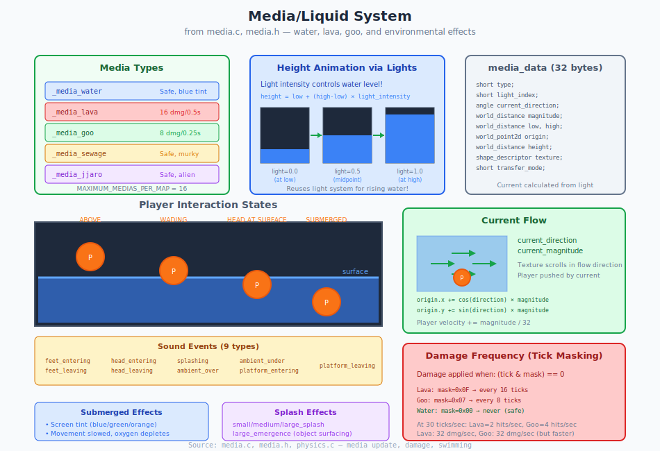

# Chapter 25: Media/Liquid System

## Water, Lava, Goo, and Environmental Effects

> **Source files**: `media.c`, `media.h`, `media_definitions.h`, `effects.h`, `fades.h`
> **Related chapters**: [Chapter 22: Fades](22_fades.md), [Chapter 26: Effects](26_effects.md)

> **For Porting:** The media system in `media.c` is fully portable (209 lines). Media rendering integrates with the standard texture system. Replace sound calls with your audio API.

---

## 25.1 What Problem Are We Solving?

Marathon needs dynamic liquid surfaces that:

- **Rise and fall** - Water levels change over time
- **Damage players** - Lava and goo hurt on contact
- **Affect movement** - Swimming physics differ from walking
- **Provide feedback** - Visual tints and sounds when submerged
- **Flow with currents** - Push players and objects

---

## 25.2 Media Types (`media.h:10-18`)

```c
enum /* media types */
{
    _media_water,
    _media_lava,
    _media_goo,
    _media_sewage,
    _media_jjaro,
    NUMBER_OF_MEDIA_TYPES
};
```

### Maximum Media Limit (`media.h:8`)

```c
#define MAXIMUM_MEDIAS_PER_MAP 16
```

---

## 25.3 Media Data Structure (`media.h:61-86`)

```c
struct media_data /* 32 bytes */
{
    short type;
    word flags;

    /* this light is not used as a real light; instead, the intensity of this light is used to
        determine the height of the media: height= low + (high-low)*intensity ... this sounds
        gross, but it makes media heights as flexible as light intensities; clearly discontinuous
        light functions (e.g., strobes) should not be used */
    short light_index;

    /* this is the maximum external velocity due to current; acceleration is 1/32nd of this */
    angle current_direction;
    world_distance current_magnitude;

    world_distance low, high;

    world_point2d origin;
    world_distance height;

    fixed minimum_light_intensity;
    shape_descriptor texture;
    short transfer_mode;

    short unused[2];
};
```

---

## 25.4 Media Flags (`media.h:20-29`)

```c
enum /* media flags */
{
    _media_sound_obstructed_by_floor, // this media makes no sound when under the floor

    NUMBER_OF_MEDIA_FLAGS /* <= 16 */
};

#define MEDIA_SOUND_OBSTRUCTED_BY_FLOOR(m) TEST_FLAG16((m)->flags, _media_sound_obstructed_by_floor)

#define SET_MEDIA_SOUND_OBSTRUCTED_BY_FLOOR(m, v) SET_FLAG16((m)->flags, _media_sound_obstructed_by_floor, (v))
```

---

## 25.5 Media Definition Structure (`media_definitions.h:8-20`)

```c
struct media_definition
{
    short collection, shape, shape_count, shape_frequency;
    short transfer_mode;

    short damage_frequency; // mask&ticks
    struct damage_definition damage;

    short detonation_effects[NUMBER_OF_MEDIA_DETONATION_TYPES];
    short sounds[NUMBER_OF_MEDIA_SOUNDS];

    short submerged_fade_effect;
};
```

---

## 25.6 Media Definitions Array (`media_definitions.h:24-100`)

```c
static struct media_definition media_definitions[NUMBER_OF_MEDIA_TYPES]=
{
    /* _media_water */
    {
        _collection_walls1, 19, 1, 0, /* collection, shape, shape_count, frequency */
        _xfer_normal, /* transfer mode */

        0, {NONE, 0, 0, 0, FIXED_ONE}, /* damage frequency and definition */

        {_effect_small_water_splash, _effect_medium_water_splash, _effect_large_water_splash, _effect_large_water_emergence},
        {NONE, NONE, _snd_enter_water, _snd_exit_water,
            _snd_walking_in_water, _ambient_snd_water, _ambient_snd_under_media,
            _snd_enter_water, _snd_exit_water},

        _effect_under_water, /* submerged fade effect */
    },

    /* _media_lava */
    {
        _collection_walls2, 12, 1, 0,
        _xfer_normal,

        0xf, {_damage_lava, _alien_damage, 16, 0, FIXED_ONE}, /* damage every 16 ticks */

        {_effect_small_lava_splash, _effect_medium_lava_splash, _effect_large_lava_splash, _effect_large_lava_emergence},
        {NONE, NONE, _snd_enter_lava, _snd_exit_lava,
            _snd_walking_in_lava, _ambient_snd_lava, _ambient_snd_under_media,
            _snd_enter_lava, _snd_exit_lava},

        _effect_under_lava,
    },

    /* _media_goo */
    {
        _collection_walls5, 5, 1, 0,
        _xfer_normal,

        0x7, {_damage_goo, _alien_damage, 8, 0, FIXED_ONE}, /* damage every 8 ticks */

        {_effect_small_goo_splash, _effect_medium_goo_splash, _effect_large_goo_splash, _effect_large_goo_emergence},
        {NONE, NONE, _snd_enter_lava, _snd_exit_lava,
            _snd_walking_in_lava, _ambient_snd_goo, _ambient_snd_under_media,
            _snd_enter_lava, _snd_exit_lava},

        _effect_under_goo,
    },

    /* _media_sewage */
    {
        _collection_walls3, 13, 1, 0,
        _xfer_normal,

        0, {NONE, 0, 0, 0, FIXED_ONE}, /* no damage */

        {_effect_small_sewage_splash, _effect_medium_sewage_splash, _effect_large_sewage_splash, _effect_large_sewage_emergence},
        {NONE, NONE, _snd_enter_sewage, _snd_exit_sewage,
            NONE, _ambient_snd_sewage, _ambient_snd_under_media,
            _snd_enter_sewage, _snd_exit_sewage},

        _effect_under_sewage,
    },

    /* _media_jjaro */
    {
        _collection_walls4, 13, 1, 0,
        _xfer_normal,

        0, {NONE, 0, 0, 0, FIXED_ONE}, /* no damage */

        {_effect_small_jjaro_splash, _effect_medium_jjaro_splash, _effect_large_jjaro_splash, _effect_large_jjaro_emergence},
        {NONE, NONE, _snd_enter_sewage, _snd_exit_sewage,
            NONE, _ambient_snd_sewage, _ambient_snd_under_media,
            _snd_enter_sewage, _snd_exit_sewage},

        _effect_under_sewage, /* jjaro uses sewage fade effect */
    },
};
```

### Media Properties Summary

| Type | Collection | Damage Freq | Damage/Hit | Submerged Effect |
|------|------------|-------------|------------|------------------|
| Water | `_collection_walls1` | Never (0) | 0 | `_effect_under_water` |
| Lava | `_collection_walls2` | 0xf (16 ticks) | 16 pts | `_effect_under_lava` |
| Goo | `_collection_walls5` | 0x7 (8 ticks) | 8 pts | `_effect_under_goo` |
| Sewage | `_collection_walls3` | Never (0) | 0 | `_effect_under_sewage` |
| Jjaro | `_collection_walls4` | Never (0) | 0 | `_effect_under_sewage` |

---

## 25.7 Height Animation via Lights (`media.c:21`, `media.c:185`)

Marathon cleverly reuses the light system for media animation:

### Height Calculation Macro (`media.c:21`)

```c
#define CALCULATE_MEDIA_HEIGHT(m) ((m)->low + FIXED_INTEGERAL_PART(((m)->high-(m)->low)*get_light_intensity((m)->light_index)))
```

### Actual Height Update (`media.c:185`)

```c
/* update height */
media->height= (media->low + FIXED_INTEGERAL_PART((media->high-media->low)*get_light_intensity(media->light_index)));
```

### Visualization

```
Light Intensity:  0.0                              1.0
                   │                                │
                   ▼                                ▼
Media Height:     low                             high
                   │                                │
                   ▼                                ▼

Intensity = 0.0:           Intensity = 0.5:           Intensity = 1.0:
┌─────────────────┐       ┌─────────────────┐       ┌─────────────────┐
│                 │       │                 │       │░░░░░░░░░░░░░░░░░│
│                 │       │                 │       │░░░ FLOODED ░░░░│
│                 │       │░░░░░░░░░░░░░░░░░│       │░░░░░░░░░░░░░░░░░│
│░░░░ water ░░░░░│       │░░░ water ░░░░░░│       │░░░░░░░░░░░░░░░░░│
└─────────────────┘       └─────────────────┘       └─────────────────┘
    (at low)                 (at midpoint)              (at high)

Benefits:
• Reuse light animation system (flicker, fade, strobe)
• Smooth transitions
• Rising water tied to light switches
• No additional code needed
```



---

## 25.8 Media Sounds (`media.h:40-53`)

```c
enum /* media sounds */
{
    _media_snd_feet_entering,
    _media_snd_feet_leaving,
    _media_snd_head_entering,
    _media_snd_head_leaving,
    _media_snd_splashing,
    _media_snd_ambient_over,
    _media_snd_ambient_under,
    _media_snd_platform_entering,
    _media_snd_platform_leaving,

    NUMBER_OF_MEDIA_SOUNDS
};
```

### Get Media Sound (`media.c:116-126`)

```c
short get_media_sound(
    short media_index,
    short type)
{
    struct media_data *media= get_media_data(media_index);
    struct media_definition *definition= get_media_definition(media->type);

    assert(type>=0 && type<NUMBER_OF_MEDIA_SOUNDS);

    return definition->sounds[type];
}
```

### Sound Transition Flow

```
Player Movement Through Media:

    ABOVE SURFACE          ENTERING             SUBMERGED
    ─────────────         ──────────           ───────────
    ambient_over    →    feet_entering   →    ambient_under
                              │                     │
                              ▼                     ▼
                         splashing ────────── splashing
                              │
                    head_entering ──────────────────┘
                              │
    ambient_over   ←    head_leaving    ←    ambient_under
         ↑                                          │
         └────────── feet_leaving ◄─────────────────┘
```

---

## 25.9 Media Detonation Effects (`media.h:31-38`, `effects.h:44-80`)

### Detonation Type Enumeration (`media.h:31-38`)

```c
enum /* media detonation types */
{
    _small_media_detonation_effect,
    _medium_media_detonation_effect,
    _large_media_detonation_effect,
    _large_media_emergence_effect,
    NUMBER_OF_MEDIA_DETONATION_TYPES
};
```

### Get Detonation Effect (`media.c:98-114`)

```c
void get_media_detonation_effect(
    short media_index,
    short type,
    short *detonation_effect)
{
    struct media_data *media= get_media_data(media_index);
    struct media_definition *definition= get_media_definition(media->type);

    if (type!=NONE)
    {
        assert(type>=0 && type<NUMBER_OF_MEDIA_DETONATION_TYPES);

        if (definition->detonation_effects[type]!=NONE) *detonation_effect= definition->detonation_effects[type];
    }

    return;
}
```

### Splash Effect Types (`effects.h:44-80`)

```c
_effect_small_water_splash,
_effect_medium_water_splash,
_effect_large_water_splash,
_effect_large_water_emergence,
_effect_small_lava_splash,
_effect_medium_lava_splash,
_effect_large_lava_splash,
_effect_large_lava_emergence,
_effect_small_sewage_splash,
_effect_medium_sewage_splash,
_effect_large_sewage_splash,
_effect_large_sewage_emergence,
_effect_small_goo_splash,
_effect_medium_goo_splash,
_effect_large_goo_splash,
_effect_large_goo_emergence,
/* ... */
_effect_small_jjaro_splash,
_effect_medium_jjaro_splash,
_effect_large_jjaro_splash,
_effect_large_jjaro_emergence,
```

---

## 25.10 Media Flow/Currents (`media.c:78-96`)

```c
void update_medias(
    void)
{
    short media_index;
    struct media_data *media;

    for (media_index= 0, media= medias; media_index<MAXIMUM_MEDIAS_PER_MAP; ++media_index, ++media)
    {
        if (SLOT_IS_USED(media))
        {
            update_one_media(media_index, FALSE);

            media->origin.x= WORLD_FRACTIONAL_PART(media->origin.x + ((cosine_table[media->current_direction]*media->current_magnitude)>>TRIG_SHIFT));
            media->origin.y= WORLD_FRACTIONAL_PART(media->origin.y + ((sine_table[media->current_direction]*media->current_magnitude)>>TRIG_SHIFT));
        }
    }

    return;
}
```

### Current Effect Visualization

```
Player in Flowing Media:

    current_direction = 128 (north)
    current_magnitude = 100

    ┌─────────────────────────┐
    │  ░░░░░░░░░░░░░░░░░░░░░  │
    │  ░░░░░░░░░░░░░░░░░░░░░  │     Flow Direction
    │  ░░░░░ ▲ ░░░░░░░░░░░░░  │           ↑
    │  ░░░░░│░░░░░░░░░░░░░░░  │           │
    │  ░░░░░●░░░░░░░░░░░░░░░  │           N
    │  ░░░░ Player ░░░░░░░░░  │
    └─────────────────────────┘

Each tick:
    origin.x += (cos(direction) * magnitude) >> TRIG_SHIFT
    origin.y += (sin(direction) * magnitude) >> TRIG_SHIFT

Texture scrolls to create flowing water effect
```

---

## 25.11 Submerged Fade Effects (`media.c:142-149`, `fades.h:56-59`, `fades.c:152-155`)

### Get Submerged Effect (`media.c:142-149`)

```c
short get_media_submerged_fade_effect(
    short media_index)
{
    struct media_data *media= get_media_data(media_index);
    struct media_definition *definition= get_media_definition(media->type);

    return definition->submerged_fade_effect;
}
```

### Fade Effect Types (`fades.h:56-59`)

```c
enum /* effect types */
{
    _effect_under_water,    /* 0 */
    _effect_under_lava,     /* 1 */
    _effect_under_sewage,   /* 2 */
    _effect_under_goo,      /* 3 */
    NUMBER_OF_FADE_EFFECT_TYPES
};
```

### Effect-to-Fade Mapping (`fades.c:152-155`)

```c
struct fade_effect_definition fade_effect_definitions[NUMBER_OF_FADE_EFFECT_TYPES]=
{
    {_fade_tint_blue, 3*FIXED_ONE/4},   /* _effect_under_water */
    {_fade_tint_orange, 3*FIXED_ONE/4}, /* _effect_under_lava */
    {_fade_tint_gross, 3*FIXED_ONE/4},  /* _effect_under_sewage */
    {_fade_tint_green, 3*FIXED_ONE/4},  /* _effect_under_goo */
};
```

| Environment | Effect Type | Fade Type | Transparency |
|-------------|-------------|-----------|--------------|
| Water | `_effect_under_water` | `_fade_tint_blue` | 75% |
| Lava | `_effect_under_lava` | `_fade_tint_orange` | 75% |
| Sewage | `_effect_under_sewage` | `_fade_tint_gross` | 75% |
| Goo | `_effect_under_goo` | `_fade_tint_green` | 75% |

---

## 25.12 Media Damage (`media.c:128-140`)

```c
struct damage_definition *get_media_damage(
    short media_index,
    fixed scale)
{
    struct media_data *media= get_media_data(media_index);
    struct media_definition *definition= get_media_definition(media->type);
    struct damage_definition *damage= &definition->damage;

    damage->scale= scale;

    return (damage->type==NONE || (dynamic_world->tick_count&definition->damage_frequency)) ?
        (struct damage_definition *) NULL : damage;
}
```

### Damage Frequency Mask Logic

The damage frequency field is a bitmask used with the tick counter:

```
Lava damage (mask 0x0F = binary 00001111):

Tick:       0   1   2   3   4   5   6   7   8   9  10  11  12  13  14  15  16  17 ...
tick & 0xF: 0   1   2   3   4   5   6   7   8   9  10  11  12  13  14  15   0   1 ...
Damage:     ★   -   -   -   -   -   -   -   -   -   -   -   -   -   -   -   ★   - ...

★ = damage applied (when tick & mask == 0)
- = no damage

Result: Damage every 16 ticks (~0.5 seconds at 30 ticks/sec)

Goo damage (mask 0x07 = binary 00000111):
Damage every 8 ticks (~0.27 seconds)
```

---

## 25.13 Media API (`media.h:94-109`)

```c
short new_media(struct media_data *data);

void update_medias(void);

void get_media_detonation_effect(short media_index, short type, short *detonation_effect);
short get_media_sound(short media_index, short type);
short get_media_submerged_fade_effect(short media_index);
struct damage_definition *get_media_damage(short media_index, fixed scale);

boolean media_in_environment(short media_type, short environment_code);

#ifdef DEBUG
struct media_data *get_media_data(short media_index);
#else
#define get_media_data(i) (medias+(i))
#endif
```

### Under Media Check Macro (`media.h:57`)

```c
#define UNDER_MEDIA(m, z) ((z)<=(m)->height)
```

---

## 25.14 New Media Creation (`media.c:46-69`)

```c
// light_index must be loaded
short new_media(
    struct media_data *initializer)
{
    struct media_data *media;
    short media_index;

    for (media_index= 0, media= medias; media_index<MAXIMUM_MEDIAS_PER_MAP; ++media_index, ++media)
    {
        if (SLOT_IS_FREE(media))
        {
            *media= *initializer;

            MARK_SLOT_AS_USED(media);

            media->origin.x= media->origin.y= 0;
            update_one_media(media_index, TRUE);

            break;
        }
    }
    if (media_index==MAXIMUM_MEDIAS_PER_MAP) media_index= NONE;

    return media_index;
}
```

---

## 25.15 Summary

Marathon's media system provides:

- **5 liquid types** with distinct behaviors (`media.h:10-18`)
- **Light-driven height** animation (`media.c:21`, `media.c:185`)
- **9 sound events** for immersive audio (`media.h:40-53`)
- **Current flow** affecting texture scrolling (`media.c:90-91`)
- **Damage frequency** via tick masking (`media.c:138`)
- **Visual tints** when submerged (`fades.c:152-155`)

### Key Constants

| Constant | Value | Source |
|----------|-------|--------|
| `MAXIMUM_MEDIAS_PER_MAP` | 16 | `media.h:8` |
| `NUMBER_OF_MEDIA_TYPES` | 5 | `media.h:17` |
| `NUMBER_OF_MEDIA_SOUNDS` | 9 | `media.h:52` |
| `NUMBER_OF_MEDIA_DETONATION_TYPES` | 4 | `media.h:37` |
| Lava damage frequency | 0x0f | `media_definitions.h:46` |
| Goo damage frequency | 0x07 | `media_definitions.h:61` |

### Key Source Files

| File | Purpose |
|------|---------|
| `media.c` | Media update logic (209 lines) |
| `media.h` | Structures and constants (110 lines) |
| `media_definitions.h` | Media type definitions (101 lines) |
| `effects.h` | Splash effect types (lines 44-80) |
| `fades.h` | Submerged effect types (lines 56-59) |
| `fades.c` | Effect-to-fade mapping (lines 152-155) |

---

## 25.16 See Also

- [Chapter 22: Fades](22_fades.md) — Screen tint effects when submerged
- [Chapter 26: Effects](26_effects.md) — Splash effects and particles
- [Chapter 6: Physics](06_physics.md) — Swimming movement mechanics

---

*Next: [Chapter 26: Visual Effects System](26_effects.md) - Explosions, splashes, and particles*
