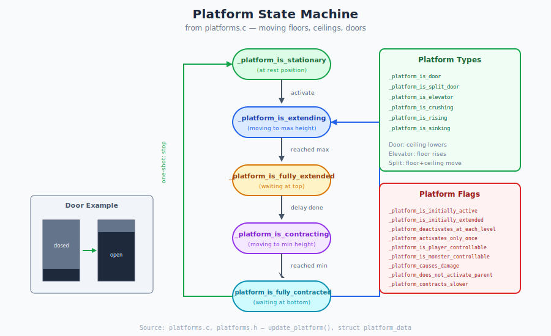

# Chapter 33: Platforms and Doors

## Moving Geometry and Level Interactivity

> **For Porting:** `platforms.c` is fully portable! No Mac dependencies. The platform system uses pure fixed-point math and integrates with collision detection seamlessly.

> **Developer Diary:** From `platforms.c:1-24` (1994-1995):
>
> *"Friday, September 16, 1994 (alain): fixed update_polygon_endpoint_data_for_height_change() so that it actually calculates highest_adjacent_floor and lowest_adjacent_ceiling correctly."*
> *"Saturday, October 29, 1994 (Jason): razed."*
> *"Tuesday, November 15, 1994 (Jason): fixed recursive activates/deactivates; added flooding."*
> *"Friday, June 9, 1995 (Jason'): keys."*
>
> — Source: `platforms.c:1-24`

---

## 33.1 What Problem Are We Solving?

Marathon needs dynamic geometry that can:

- **Open and close doors** for player progression and combat pacing
- **Elevate players** between floor levels via platforms/elevators
- **Create crushers** that damage players and monsters
- **Trigger chain reactions** where one platform activates others
- **Block or allow monsters** through AI-aware pathfinding integration

**The constraints:**
- Must work with the 2.5D polygon-based world (no true 3D moving objects)
- Must integrate with collision detection (can't clip through moving floors)
- Must be deterministic (critical for networking)
- Must support complex behaviors via flags (one-shot, locked, reversing, etc.)

**Marathon's solution: Platforms as Moving Polygon Heights**

Platforms don't move as separate objects—they modify the floor and ceiling heights of their host polygon. This elegant approach reuses the existing collision and rendering systems.

---

## 33.2 Platform Architecture

### How Platforms Work

```
PLATFORM CONCEPT:

Before:                          After (extended):
┌─────────────────────┐          ┌─────────────────────┐
│                     │          │▓▓▓▓▓▓▓▓▓▓▓▓▓▓▓▓▓▓▓▓▓│ ← ceiling lowered
│    Open Space       │          │                     │
│                     │    →     │                     │
│                     │          │                     │
│▓▓▓▓▓▓▓▓▓▓▓▓▓▓▓▓▓▓▓▓▓│          │▓▓▓▓▓▓▓▓▓▓▓▓▓▓▓▓▓▓▓▓▓│ ← floor raised
└─────────────────────┘          └─────────────────────┘

Platform = polygon with animated floor_height and/or ceiling_height
```

### Platform Types

From `platforms.h:15-28`, Marathon defines 9 platform types:

| ID | Type | Description | Default Behavior |
|----|------|-------------|------------------|
| 0 | `_platform_is_spht_door` | S'phtian door | Fast, from ceiling, reverses when blocked |
| 1 | `_platform_is_spht_split_door` | Split S'phtian door | Slow, from both floor AND ceiling |
| 2 | `_platform_is_locked_spht_door` | Locked S'phtian door | Requires key item |
| 3 | `_platform_is_spht_platform` | S'phtian elevator | Silent, from floor |
| 4 | `_platform_is_noisy_spht_platform` | Noisy S'phtian elevator | With sound effects |
| 5 | `_platform_is_heavy_spht_door` | Heavy S'phtian door | Slow, heavy sounds |
| 6 | `_platform_is_pfhor_door` | Pfhor door | Fast, from ceiling |
| 7 | `_platform_is_heavy_spht_platform` | Heavy S'phtian platform | Slow, heavy sounds |
| 8 | `_platform_is_pfhor_platform` | Pfhor platform | Standard elevator |

### Platform Direction Modes

Platforms can move from floor, ceiling, or both:

```
FROM FLOOR ONLY:                 FROM CEILING ONLY:
                                 ┌──────────────┐
┌──────────────┐                 │▓▓▓▓▓▓▓▓▓▓▓▓▓▓│ ← ceiling lowers
│              │                 │              │
│              │ ceiling fixed   │              │
│              │                 │              │
│▓▓▓▓▓▓▓▓▓▓▓▓▓▓│ ← floor rises   └──────────────┘
└──────────────┘                 floor fixed


SPLIT DOOR (BOTH):
┌──────────────┐
│▓▓▓▓▓▓▓▓▓▓▓▓▓▓│ ← ceiling lowers
│              │
│              │
│▓▓▓▓▓▓▓▓▓▓▓▓▓▓│ ← floor rises (closes from both ends)
└──────────────┘
```

---

## 33.3 Platform Data Structures

### Static Platform Data (Editor-Defined)

From `platforms.h:186-199`:

```c
struct static_platform_data {
    short type;                    // Platform type (0-8)
    short speed, delay;            // Movement speed, pause at extremes
    world_distance maximum_height; // Upper limit (NONE = calculate)
    world_distance minimum_height; // Lower limit (NONE = calculate)

    unsigned long static_flags;    // 27 behavior flags

    short polygon_index;           // Host polygon
    short tag;                     // For scripted triggers

    short unused[7];
};
```

### Dynamic Platform Data (Runtime State)

From `platforms.h:201-221`:

```c
struct platform_data {  /* 128 bytes */
    short type;
    unsigned long static_flags;
    short speed, delay;

    // Height limits (calculated from polygon or specified)
    world_distance minimum_floor_height, maximum_floor_height;
    world_distance minimum_ceiling_height, maximum_ceiling_height;

    short polygon_index;
    word dynamic_flags;            // 10 runtime state flags

    // Current position
    world_distance floor_height, ceiling_height;
    short ticks_until_restart;     // Countdown while paused

    // Endpoint ownership for height propagation
    struct endpoint_owner_data endpoint_owners[MAXIMUM_VERTICES_PER_POLYGON];

    short parent_platform_index;   // Platform that activated us
    short tag;

    short unused[22];
};
```

---

## 33.4 Platform State Machine



### Dynamic Flags (Runtime State)

From `platforms.h:138-151`:

| Flag | Bit | Description |
|------|-----|-------------|
| `_platform_is_active` | 0 | Platform is running (otherwise dormant) |
| `_platform_is_extending` | 1 | Moving toward extended position |
| `_platform_is_moving` | 2 | Currently in motion (not paused) |
| `_platform_has_been_activated` | 3 | Has been triggered at least once |
| `_platform_was_moving` | 4 | Moved last tick (not blocked) |
| `_platform_is_fully_extended` | 5 | At maximum extension |
| `_platform_is_fully_contracted` | 6 | At minimum extension |
| `_platform_was_just_activated_or_deactivated` | 7 | State changed this tick |
| `_platform_floor_below_media` | 8 | Floor is underwater |
| `_platform_ceiling_below_media` | 9 | Ceiling is underwater |

### State Transition Diagram

```
                         Player/Monster activates
                                    │
                                    ▼
                        ┌───────────────────────┐
                        │      INACTIVE         │
                        │  (not moving, dormant)│
                        └───────────┬───────────┘
                                    │
                          try_and_change_platform_state()
                          set_platform_state(TRUE)
                                    │
                                    ▼
                        ┌───────────────────────┐
           ┌───────────►│       ACTIVE          │◄───────────┐
           │            │   _platform_is_active │            │
           │            └───────────┬───────────┘            │
           │                        │                        │
           │              PLATFORM_IS_MOVING?                │
           │            ┌───────────┴───────────┐            │
           │            │                       │            │
           │            ▼                       ▼            │
           │   ┌─────────────────┐     ┌─────────────────┐   │
           │   │     WAITING     │     │     MOVING      │   │
           │   │ ticks_until_    │     │ Adjusting floor │   │
           │   │ restart > 0     │     │ and/or ceiling  │   │
           │   └────────┬────────┘     └────────┬────────┘   │
           │            │                       │            │
           │    ticks_until_restart             │            │
           │         == 0                       │            │
           │            │              ┌────────┴────────┐   │
           │            │              │                 │   │
           │            ▼              ▼                 ▼   │
           │   ┌─────────────┐   ┌───────────┐   ┌──────────┐
           │   │  START      │   │ BLOCKED   │   │ REACHED  │
           │   │  MOVING     │   │ (obstacle)│   │ EXTREME  │
           │   └─────────────┘   └─────┬─────┘   └────┬─────┘
           │                           │              │
           │              REVERSES_DIRECTION?         │
           │              ┌────────────┤              │
           │              │            │              │
           │              ▼            ▼              ▼
           │        Reverse dir   Stay blocked   Change direction
           │                                     Set delay timer
           │                                          │
           │                      DEACTIVATES_AT_EACH_LEVEL?
           │                      DEACTIVATES_AT_INITIAL_LEVEL?
           │                              │
           │                              ▼
           │                     ┌─────────────────┐
           └─────────────────────│   DEACTIVATE    │
                                 │ _platform_is_   │
                                 │  active = FALSE │
                                 └─────────────────┘
```

### Update Loop

From `platforms.c:176-308`, the `update_platforms()` function:

```c
void update_platforms(void)
{
    for each platform:
        CLEAR_PLATFORM_WAS_JUST_ACTIVATED_OR_DEACTIVATED(platform);

        if (PLATFORM_IS_ACTIVE(platform))
        {
            if (!PLATFORM_IS_MOVING(platform))
            {
                // Waiting between movements
                if (--platform->ticks_until_restart <= 0)
                {
                    SET_PLATFORM_IS_MOVING(platform, TRUE);
                    play_sound(_starting_sound);
                }
            }

            if (PLATFORM_IS_MOVING(platform))
            {
                // Calculate height delta
                delta_height = PLATFORM_IS_EXTENDING(platform)
                    ? platform->speed
                    : -platform->speed;

                // Try to change polygon height
                if (change_polygon_height(...))
                {
                    // Success: update heights
                    platform->floor_height = new_floor_height;
                    platform->ceiling_height = new_ceiling_height;
                    adjust_platform_endpoint_and_line_heights();
                }
                else
                {
                    // Blocked by object/player
                    if (PLATFORM_REVERSES_DIRECTION_WHEN_OBSTRUCTED(platform))
                        reverse_direction();
                    play_sound(_obstructed_sound);
                }

                // Check if reached extreme position
                if (PLATFORM_IS_FULLY_EXTENDED(platform) ||
                    PLATFORM_IS_FULLY_CONTRACTED(platform))
                {
                    SET_PLATFORM_IS_MOVING(platform, FALSE);
                    platform->ticks_until_restart = platform->delay;
                    reverse_direction();

                    // Maybe deactivate
                    if (PLATFORM_DEACTIVATES_AT_EACH_LEVEL(platform))
                        set_platform_state(platform_index, FALSE, NONE);
                }
            }
        }
}
```

---

## 33.5 Static Flags Reference

From `platforms.h:48-78`, platforms have 27 behavior flags:

### Movement Behavior

| Flag | Bit | Description |
|------|-----|-------------|
| `_platform_is_initially_active` | 0 | Starts running immediately |
| `_platform_is_initially_extended` | 1 | Starts at max extension |
| `_platform_comes_from_floor` | 6 | Floor height changes |
| `_platform_comes_from_ceiling` | 7 | Ceiling height changes |
| `_platform_extends_floor_to_ceiling` | 5 | No gap when fully extended |
| `_platform_contracts_slower` | 21 | Retraction at 1/4 speed |

### Activation Control

| Flag | Bit | Description |
|------|-----|-------------|
| `_platform_deactivates_at_each_level` | 2 | Stops at every extreme |
| `_platform_deactivates_at_initial_level` | 3 | Stops when returning to start |
| `_platform_activates_only_once` | 10 | Cannot be reactivated |
| `_platform_is_player_controllable` | 13 | Action key toggles state |
| `_platform_is_monster_controllable` | 14 | Monsters can open doors |
| `_platform_cannot_be_externally_deactivated` | 16 | Only deactivates itself |
| `_platform_delays_before_activation` | 18 | Wait before first movement |

### Adjacent Platform Triggers

| Flag | Bit | Description |
|------|-----|-------------|
| `_platform_activates_adjacent_platforms_when_deactivating` | 4 | Trigger neighbors on stop |
| `_platform_activates_adjacent_platforms_when_activating` | 19 | Trigger neighbors on start |
| `_platform_deactivates_adjacent_platforms_when_activating` | 20 | Stop neighbors on start |
| `_platform_deactivates_adjacent_platforms_when_deactivating` | 21 | Stop neighbors on stop |
| `_platform_activates_adjacent_platforms_at_each_level` | 23 | Trigger at every extreme |
| `_platform_does_not_activate_parent` | 9 | Don't retrigger activator |

### Special Behaviors

| Flag | Bit | Description |
|------|-----|-------------|
| `_platform_causes_damage` | 8 | Crushes monsters/players |
| `_platform_reverses_direction_when_obstructed` | 15 | Don't crush, reverse |
| `_platform_uses_native_polygon_heights` | 17 | Use polygon heights for limits |
| `_platform_activates_light` | 11 | Turn on lights when active |
| `_platform_deactivates_light` | 12 | Turn off lights when active |
| `_platform_is_locked` | 24 | Requires key |
| `_platform_is_secret` | 25 | Secret area |
| `_platform_is_door` | 26 | Treated as door for AI |

---

## 33.6 Speed and Delay Constants

### Speed Constants

From `platforms.h:30-37`:

| Constant | Value | Units/Second | Description |
|----------|-------|--------------|-------------|
| `_very_slow_platform` | WORLD_ONE/120 | ~8.5 | Creeping |
| `_slow_platform` | WORLD_ONE/60 | ~17 | Standard elevator |
| `_fast_platform` | WORLD_ONE/30 | ~34 | Standard door |
| `_very_fast_platform` | WORLD_ONE/20 | ~51 | Fast door |
| `_blindingly_fast_platform` | WORLD_ONE/15 | ~68 | Instant-feeling |

### Delay Constants

From `platforms.h:39-46`:

| Constant | Ticks | Seconds | Description |
|----------|-------|---------|-------------|
| `_no_delay_platform` | 0 | 0 | Immediate (dangerous for respawn) |
| `_short_delay_platform` | 30 | 1.0 | Quick pause |
| `_long_delay_platform` | 60 | 2.0 | Standard pause |
| `_very_long_delay_platform` | 120 | 4.0 | Long pause |
| `_extremely_long_delay_platform` | 240 | 8.0 | Very long pause |

---

## 33.7 Monster Pathfinding Integration

Platforms integrate with the AI pathfinding system to allow monsters to navigate through doors and ride elevators.

### Accessibility Functions

From `platforms.c:320-420`:

```c
// Can a monster enter this platform polygon?
short monster_can_enter_platform(
    short platform_index,
    short source_polygon_index,
    world_distance height,           // Monster height
    world_distance minimum_ledge_delta,  // Min step up
    world_distance maximum_ledge_delta)  // Max step up
{
    // For doors: check if monster-controllable and will open
    if (PLATFORM_IS_DOOR(platform))
    {
        if (PLATFORM_IS_MONSTER_CONTROLLABLE(platform) &&
            platform->delay >= _short_delay_platform)
        {
            // Door will open, use contracted heights
            return PLATFORM_IS_FULLY_CONTRACTED(platform)
                ? _platform_is_accessable
                : _platform_will_be_accessable;
        }
    }

    // For elevators: check if it stops at source level
    // ... height calculations ...

    return result_code;
}
```

### Return Codes

From `platforms.h:239-250`:

| Code | Value | Meaning |
|------|-------|---------|
| `_platform_will_never_be_accessable` | 0 | Impossible to traverse |
| `_platform_will_be_accessable` | 1 | Will become passable |
| `_platform_might_be_accessable` | 2 | Uncertain |
| `_platform_is_accessable` | 3 | Currently passable |
| `_exit_will_never_be_accessable` | 4 | Can't leave platform |
| `_exit_will_be_accessable` | 5 | Will be able to leave |
| `_exit_might_be_accessable` | 6 | Uncertain |
| `_exit_is_accessable` | 7 | Can leave now |

---

## 33.8 Adjacent Platform Activation

Platforms can trigger neighboring platforms, creating chain reactions.

### Activation Chain Flow

```
Player steps on Platform A (trigger polygon):
           │
           ▼
    platform_was_entered(A)
           │
           ▼
    set_platform_state(A, TRUE)
           │
           ▼
    Platform A starts moving
           │
           ▼
    Platform A reaches extreme
           │
           ▼
    PLATFORM_ACTIVATES_ADJACENT_PLATFORMS_AT_EACH_LEVEL?
           │
           YES
           │
           ▼
    set_adjacent_platform_states(A, TRUE)
           │
           ▼
    For each polygon sharing a line with A:
        If that polygon is a platform:
            set_platform_state(adjacent, TRUE)
```

### Implementation

From `platforms.c` (conceptual):

```c
static void set_adjacent_platform_states(short platform_index, boolean state)
{
    struct platform_data *platform = get_platform_data(platform_index);
    struct polygon_data *polygon = get_polygon_data(platform->polygon_index);

    for (int i = 0; i < polygon->vertex_count; i++)
    {
        short adjacent_polygon = polygon->adjacent_polygon_indexes[i];

        if (adjacent_polygon != NONE)
        {
            struct polygon_data *adj = get_polygon_data(adjacent_polygon);

            if (adj->type == _polygon_is_platform)
            {
                short adjacent_platform = adj->permutation;
                set_platform_state(adjacent_platform, state, platform_index);
            }
        }
    }
}
```

---

## 33.9 Platform Definition Table

From `platform_definitions.h:36-202`, each platform type has default settings:

| Type | Speed | Delay | Key Flags | Sound Set |
|------|-------|-------|-----------|-----------|
| S'pht Door | fast | very_long | ceiling, door, reversing | spht_door |
| Split Door | slow | very_long | both, door, reversing | spht_door |
| Locked Door | slow | very_long | both, door, reversing, locked | spht_door |
| S'pht Platform | slow | long | floor, active, reversing | (silent) |
| Noisy Platform | slow | long | floor, active, reversing | spht_platform |
| Heavy Door | slow | very_long | ceiling, door, reversing | heavy_spht_door |
| Pfhor Door | fast | very_long | ceiling, door, reversing | pfhor_door |
| Heavy Platform | slow | long | floor, active, reversing | heavy_spht_platform |
| Pfhor Platform | slow | long | floor, active, reversing | pfhor_platform |

### Sound Codes

From `platform_definitions.h:8-14`:

```c
enum {
    _stopping_sound,       // 0: Platform reached extreme
    _starting_sound,       // 1: Platform began moving
    _obstructed_sound,     // 2: Platform blocked
    _uncontrollable_sound  // 3: Player can't operate
};
```

---

## 33.10 Crusher Damage

Platforms with `_platform_causes_damage` can crush monsters and players.

### Damage Application

From `platform_definitions.h` and `platforms.c:239-240`:

```c
// When platform movement is blocked, apply damage
if (change_polygon_height(platform->polygon_index,
    new_floor_height, new_ceiling_height,
    PLATFORM_CAUSES_DAMAGE(platform) ? &definition->damage : NULL))
```

### Default Crusher Damage

| Platform Type | Damage Type | Base | Random | Scale |
|---------------|-------------|------|--------|-------|
| S'pht Door | `_damage_crushing` | 30 | 10 | FIXED_ONE |
| Split Door | `_damage_crushing` | 5 | 4 | FIXED_ONE |
| Heavy Door | `_damage_crushing` | 5 | 4 | FIXED_ONE |

**Note:** `_damage_crushing` bypasses shields and directly reduces health.

---

## 33.11 Summary

### Key Concepts

- **Platforms modify polygon heights** — not separate 3D objects
- **27 static flags** control all behavior variations
- **10 dynamic flags** track runtime state
- **Adjacent activation** enables chain reactions
- **AI integration** allows monsters to use doors and elevators

### Key Constants

| Constant | Value | Purpose |
|----------|-------|---------|
| `MAXIMUM_PLATFORMS_PER_MAP` | 64 | Platform limit |
| `NUMBER_OF_PLATFORM_TYPES` | 9 | Built-in types |
| `TICKS_PER_SECOND` | 30 | Speed calculation base |

### Key Source Files

| File | Lines | Purpose |
|------|-------|---------|
| `platforms.c` | ~1,100 | Platform logic |
| `platforms.h` | ~270 | Data structures, flags |
| `platform_definitions.h` | ~200 | Type defaults |

### Source Reference Summary

| Function | Location | Purpose |
|----------|----------|---------|
| `new_platform()` | platforms.c:78 | Create platform from map data |
| `update_platforms()` | platforms.c:176 | Main update loop |
| `set_platform_state()` | platforms.c | Activate/deactivate |
| `monster_can_enter_platform()` | platforms.c:320 | AI pathfinding query |
| `monster_can_leave_platform()` | platforms.c:379 | AI pathfinding query |
| `player_touch_platform_state()` | platforms.c:422 | Player interaction |
| `try_and_change_platform_state()` | platforms.c | External trigger |

---

*Next: [Chapter 34: Dynamic Lighting](34_lighting.md) - Light animation and shading*

