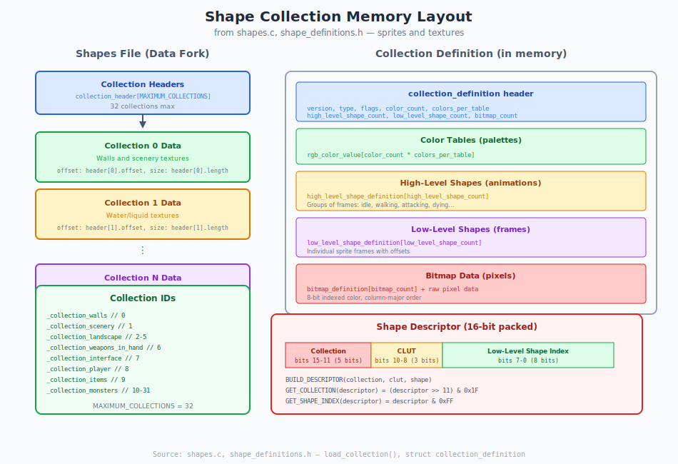

# Appendix L: Shapes File Format

> **Source files**: `shapes.c`, `shape_definitions.h`, `collection_definition.h`, `textures.h`
> **Related chapters**: [Chapter 19: Shapes](19_shapes.md), [Chapter 5: Rendering](05_rendering.md)

Marathon stores all sprite and texture graphics in **Shapes files** (`Shapes8` or `Shapes16`). This appendix documents the byte-level format for parsing these files.

---

## Overview

Shapes files contain multiple **collections** — groups of related graphics. Each collection contains color tables, animations (high-level shapes), frames (low-level shapes), and pixel bitmaps.

```
Shapes File Structure:
┌────────────────────────────────────────┐
│ Collection Headers                     │
│   [32 entries × 32 bytes = 1024 bytes] │
├────────────────────────────────────────┤
│ Collection 0 Data                      │
│   collection_definition                │
│   color_tables                         │
│   high_level_shapes                    │
│   low_level_shapes                     │
│   bitmaps                              │
├────────────────────────────────────────┤
│ Collection 1 Data                      │
│   ...                                  │
├────────────────────────────────────────┤
│ ...                                    │
└────────────────────────────────────────┘
```



**File type constant** (`tags.h:21`):
```c
#define SHAPES_FILE_TYPE 'shp∞'
```

**Maximum collections** (`shapes.c`):
```c
#define MAXIMUM_COLLECTIONS 32
```

---

## Collection Header

The file begins with an array of 32 collection headers (`shape_definitions.h:8-26`):

```c
struct collection_header {  /* 32 bytes */
    short status;           /* loaded status flags */
    word flags;             /* [unused.16] */

    long offset;            /* offset to 8-bit collection data */
    long length;            /* length of 8-bit collection data */
    long offset16;          /* offset to 16-bit collection data (if exists) */
    long length16;          /* length of 16-bit collection data */

    /* platform-specific runtime pointers (not saved to disk) */
    /* on disk these are zeros or undefined */
    short unused[6];        /* pad to 32 bytes */
};
```

**Byte-swap specification** (`shape_definitions.h:30-34`):
```c
static _bs_field _bs_collection_header[] = {
    _2byte, _2byte,         /* status, flags */
    _4byte, _4byte,         /* offset, length */
    _4byte, _4byte,         /* offset16, length16 */
    _4byte, _4byte,         /* unused (pointers on mac) */
    _2byte, _2byte          /* unused shorts */
};
```

**Notes**:
- `offset` and `length` point to 8-bit color depth data
- `offset16` and `length16` point to 16-bit color depth data (higher quality)
- If `length == 0`, the collection slot is unused
- Offsets are absolute file positions from beginning of file

---

## Collection Definition

At each collection's offset, you'll find the collection definition (`collection_definition.h:36-60`):

```c
#define COLLECTION_VERSION 3

struct collection_definition {
    short version;                              /* should be COLLECTION_VERSION (3) */

    short type;                                 /* collection type enum */
    word flags;                                 /* [unused.16] */

    short color_count;                          /* colors per CLUT */
    short clut_count;                           /* number of CLUTs */
    long color_table_offset;                    /* offset to color data */

    short high_level_shape_count;               /* number of animations */
    long high_level_shape_offset_table_offset;  /* offset to HLS offset table */

    short low_level_shape_count;                /* number of frames */
    long low_level_shape_offset_table_offset;   /* offset to LLS offset table */

    short bitmap_count;                         /* number of bitmaps */
    long bitmap_offset_table_offset;            /* offset to bitmap offset table */

    short pixels_to_world;                      /* scaling factor */

    long size;                                  /* total size (for validation) */

    short unused[253];                          /* padding */
};
/* Total size: 2+2+2+2+2+4+2+4+2+4+2+4+2+4+506 = 544 bytes */
```

**Collection types** (`collection_definition.h:27-34`):
```c
enum {
    _unused_collection = 0,     /* not used */
    _wall_collection,           /* wall textures (raw pixels) */
    _object_collection,         /* monsters/items (RLE compressed) */
    _interface_collection,      /* HUD elements (raw pixels) */
    _scenery_collection         /* scenery objects (RLE compressed) */
};
```

**All offsets within a collection are relative to the start of the collection_definition**.

---

## Color Tables

Color tables provide palettes for rendering. Located at `color_table_offset` within the collection:

```c
#define NUMBER_OF_PRIVATE_COLORS 3  /* reserved at start */

struct rgb_color_value {  /* 8 bytes */
    byte flags;           /* SELF_LUMINESCENT_COLOR_FLAG = 0x80 */
    byte value;           /* palette index */

    word red;             /* 0-65535 */
    word green;           /* 0-65535 */
    word blue;            /* 0-65535 */
};
```

**Layout**:
```
Color Table Data:
┌────────────────────────────────────────┐
│ CLUT 0: [color_count × rgb_color_value]│
├────────────────────────────────────────┤
│ CLUT 1: [color_count × rgb_color_value]│
├────────────────────────────────────────┤
│ ...                                    │
├────────────────────────────────────────┤
│ CLUT N: [color_count × rgb_color_value]│
└────────────────────────────────────────┘
Total entries: clut_count × color_count
```

**Flags**:
```c
enum {
    SELF_LUMINESCENT_COLOR_FLAG = 0x80  /* not affected by lighting */
};
```

---

## High-Level Shape Definition (Animations)

High-level shapes define animations — sequences of frames from multiple view angles. Access via the offset table at `high_level_shape_offset_table_offset`:

```c
#define HIGH_LEVEL_SHAPE_NAME_LENGTH 32

struct high_level_shape_definition {
    short type;                 /* must be 0 */
    word flags;                 /* [unused.16] */

    char name[HIGH_LEVEL_SHAPE_NAME_LENGTH+1];  /* 33 bytes, null-terminated */

    short number_of_views;      /* view angles (1, 2, 4, 5, or 8) */

    short frames_per_view;      /* animation frames per view */
    short ticks_per_frame;      /* duration of each frame */
    short key_frame;            /* frame index for key events */

    short transfer_mode;        /* rendering transfer mode */
    short transfer_mode_period; /* transfer mode cycle time */

    short first_frame_sound;    /* sound at animation start */
    short key_frame_sound;      /* sound at key frame */
    short last_frame_sound;     /* sound at animation end */

    short pixels_to_world;      /* scaling override */

    short loop_frame;           /* frame to loop back to (-1 = don't loop) */

    short unused[14];           /* padding */

    /* variable-length array follows */
    short low_level_shape_indexes[1];  /* [number_of_views × frames_per_view] */
};
```

**View layouts**:
```
1 view:  Front only (symmetric)
2 views: Front, Back
4 views: Front, Right, Back, Left (90° increments)
5 views: Front, FrontRight, Right, BackRight, Back (mirrored for left)
8 views: All 8 cardinal directions
```

**Accessing high-level shapes**:
```c
/* read offset table */
long *hls_offsets = malloc(high_level_shape_count * sizeof(long));
fseek(f, collection_offset + high_level_shape_offset_table_offset, SEEK_SET);
fread(hls_offsets, sizeof(long), high_level_shape_count, f);

/* byte swap offsets */
for (int i = 0; i < high_level_shape_count; i++) {
    hls_offsets[i] = swap32(hls_offsets[i]);
}

/* read specific high-level shape */
fseek(f, collection_offset + hls_offsets[shape_index], SEEK_SET);
struct high_level_shape_definition hls;
fread(&hls, sizeof(hls), 1, f);
/* byte swap fields... */

/* read low_level_shape_indexes array */
int frame_count = hls.number_of_views * hls.frames_per_view;
short *frame_indexes = malloc(frame_count * sizeof(short));
fread(frame_indexes, sizeof(short), frame_count, f);
```

---

## Low-Level Shape Definition (Frames)

Low-level shapes are individual frames — single images with positioning data. Access via offset table at `low_level_shape_offset_table_offset`:

```c
struct low_level_shape_definition {
    word flags;                 /* mirroring and visibility flags */

    fixed minimum_light_intensity;  /* minimum lighting (0 to FIXED_ONE) */

    short bitmap_index;         /* which bitmap contains pixel data */

    /* origin point in pixel coordinates */
    short origin_x, origin_y;

    /* key point in pixel coordinates (for alignment) */
    short key_x, key_y;

    /* world-space bounds (for collision/rendering) */
    short world_left, world_right;
    short world_top, world_bottom;
    short world_x0, world_y0;

    short unused[4];            /* padding */
};
/* Total size: 36 bytes */
```

**Flags** (`collection_definition.h:95-97`):
```c
#define _X_MIRRORED_BIT       0x8000  /* flip horizontally */
#define _Y_MIRRORED_BIT       0x4000  /* flip vertically */
#define _KEYPOINT_OBSCURED_BIT 0x2000 /* keypoint hidden behind sprite */
```

**Byte-swap specification**:
```c
static _bs_field _bs_low_level_shape_definition[] = {
    _2byte,                 /* flags */
    _4byte,                 /* minimum_light_intensity */
    _2byte,                 /* bitmap_index */
    _2byte, _2byte,         /* origin_x, origin_y */
    _2byte, _2byte,         /* key_x, key_y */
    _2byte, _2byte, _2byte, _2byte,  /* world bounds */
    _2byte, _2byte,         /* world_x0, world_y0 */
    4*sizeof(short)         /* unused */
};
```

---

## Bitmap Definition

Bitmaps contain the actual pixel data. Access via offset table at `bitmap_offset_table_offset`:

```c
struct bitmap_definition {
    short width, height;    /* dimensions in pixels */
    short bytes_per_row;    /* if NONE (-1), this is RLE compressed */

    short flags;            /* [column_order.1] [unused.15] */
    short bit_depth;        /* always 8 for Marathon */

    short unused[8];        /* padding */

    /* pixel data or row_addresses follow */
    pixel8 *row_addresses[1];  /* variable-length array */
};
```

**Bitmap flags**:
```c
#define _COLUMN_ORDER_BIT 0x8000  /* pixels stored column-major */
```

**Pixel data layout**:
```
If bytes_per_row != NONE (raw bitmap):
┌────────────────────────────────────────┐
│ bitmap_definition header               │
├────────────────────────────────────────┤
│ Row 0: [width bytes]                   │
│ Row 1: [width bytes]                   │
│ ...                                    │
│ Row N: [width bytes]                   │
└────────────────────────────────────────┘

If bytes_per_row == NONE (RLE compressed):
┌────────────────────────────────────────┐
│ bitmap_definition header               │
├────────────────────────────────────────┤
│ first_column (short)                   │
│ last_column (short)                    │
├────────────────────────────────────────┤
│ Column offset table                    │
│ [last_column - first_column + 1 longs] │
├────────────────────────────────────────┤
│ RLE column data                        │
└────────────────────────────────────────┘
```

---

## RLE Compression Format

Object and scenery collections use RLE (Run-Length Encoding) for transparency:

```c
/* RLE column format */
struct rle_column {
    /* offset table entry points here */
    /* repeat until column complete: */
    short run_count;        /* number of pixels or skip */
                           /* if negative: skip (-run_count) transparent pixels */
                           /* if positive: read run_count opaque pixels */
    /* pixel8 pixels[run_count]; if run_count > 0 */
};
```

**Decoding RLE column**:
```c
void decode_rle_column(byte *src, byte *dest, short height) {
    short y = 0;

    while (y < height) {
        short run = (short)(src[0] << 8 | src[1]);  /* big-endian */
        src += 2;

        if (run < 0) {
            /* transparent run: skip -run pixels */
            y += -run;
        } else if (run > 0) {
            /* opaque run: copy run pixels */
            memcpy(dest + y, src, run);
            src += run;
            y += run;
        } else {
            /* run == 0: end of column */
            break;
        }
    }
}
```

---

## Complete Parsing Example

```c
#include <stdio.h>
#include <stdlib.h>
#include <string.h>

/* byte swapping */
short swap16(short val) {
    return ((val & 0xFF) << 8) | ((val >> 8) & 0xFF);
}

long swap32(long val) {
    return ((val & 0xFF) << 24) | ((val & 0xFF00) << 8) |
           ((val >> 8) & 0xFF00) | ((val >> 24) & 0xFF);
}

#define MAXIMUM_COLLECTIONS 32

struct collection_header {
    short status;
    unsigned short flags;
    long offset, length;
    long offset16, length16;
    short unused[6];
};

struct collection_definition {
    short version;
    short type;
    unsigned short flags;
    short color_count, clut_count;
    long color_table_offset;
    short high_level_shape_count;
    long high_level_shape_offset_table_offset;
    short low_level_shape_count;
    long low_level_shape_offset_table_offset;
    short bitmap_count;
    long bitmap_offset_table_offset;
    short pixels_to_world;
    long size;
    short unused[253];
};

struct rgb_color_value {
    unsigned char flags;
    unsigned char value;
    unsigned short red, green, blue;
};

void byte_swap_collection_header(struct collection_header *h) {
    h->status = swap16(h->status);
    h->flags = swap16(h->flags);
    h->offset = swap32(h->offset);
    h->length = swap32(h->length);
    h->offset16 = swap32(h->offset16);
    h->length16 = swap32(h->length16);
}

void byte_swap_collection_definition(struct collection_definition *d) {
    d->version = swap16(d->version);
    d->type = swap16(d->type);
    d->flags = swap16(d->flags);
    d->color_count = swap16(d->color_count);
    d->clut_count = swap16(d->clut_count);
    d->color_table_offset = swap32(d->color_table_offset);
    d->high_level_shape_count = swap16(d->high_level_shape_count);
    d->high_level_shape_offset_table_offset =
        swap32(d->high_level_shape_offset_table_offset);
    d->low_level_shape_count = swap16(d->low_level_shape_count);
    d->low_level_shape_offset_table_offset =
        swap32(d->low_level_shape_offset_table_offset);
    d->bitmap_count = swap16(d->bitmap_count);
    d->bitmap_offset_table_offset = swap32(d->bitmap_offset_table_offset);
    d->pixels_to_world = swap16(d->pixels_to_world);
    d->size = swap32(d->size);
}

boolean parse_shapes_file(const char *filename) {
    FILE *f;
    struct collection_header headers[MAXIMUM_COLLECTIONS];
    int i;

    f = fopen(filename, "rb");
    if (!f) return FALSE;

    /* 1. read all collection headers */
    for (i = 0; i < MAXIMUM_COLLECTIONS; i++) {
        fread(&headers[i], sizeof(struct collection_header), 1, f);
        byte_swap_collection_header(&headers[i]);
    }

    printf("Shapes file: %s\n", filename);
    printf("=====================================\n\n");

    /* 2. process each collection */
    for (i = 0; i < MAXIMUM_COLLECTIONS; i++) {
        struct collection_definition def;
        long collection_offset;

        if (headers[i].length == 0) continue;  /* empty slot */

        collection_offset = headers[i].offset;

        printf("Collection %d:\n", i);
        printf("  Offset: %ld, Length: %ld\n",
            headers[i].offset, headers[i].length);

        /* read collection definition */
        fseek(f, collection_offset, SEEK_SET);
        fread(&def, sizeof(struct collection_definition), 1, f);
        byte_swap_collection_definition(&def);

        printf("  Version: %d\n", def.version);
        printf("  Type: %d ", def.type);
        switch (def.type) {
            case 0: printf("(unused)\n"); break;
            case 1: printf("(wall)\n"); break;
            case 2: printf("(object)\n"); break;
            case 3: printf("(interface)\n"); break;
            case 4: printf("(scenery)\n"); break;
            default: printf("(unknown)\n"); break;
        }
        printf("  Colors: %d per CLUT, %d CLUTs\n",
            def.color_count, def.clut_count);
        printf("  High-level shapes: %d\n", def.high_level_shape_count);
        printf("  Low-level shapes: %d\n", def.low_level_shape_count);
        printf("  Bitmaps: %d\n", def.bitmap_count);
        printf("  Pixels to world: %d\n", def.pixels_to_world);
        printf("\n");
    }

    fclose(f);
    return TRUE;
}

/* extract a specific bitmap */
boolean extract_bitmap(const char *filename, int collection_index,
                       int bitmap_index, unsigned char **pixels,
                       int *width, int *height)
{
    FILE *f;
    struct collection_header header;
    struct collection_definition def;
    long collection_offset;
    long *bitmap_offsets;
    struct {
        short width, height;
        short bytes_per_row;
        short flags;
        short bit_depth;
        short unused[8];
    } bitmap_header;

    f = fopen(filename, "rb");
    if (!f) return FALSE;

    /* seek to and read collection header */
    fseek(f, collection_index * sizeof(struct collection_header), SEEK_SET);
    fread(&header, sizeof(header), 1, f);
    byte_swap_collection_header(&header);

    if (header.length == 0) {
        fclose(f);
        return FALSE;
    }

    collection_offset = header.offset;

    /* read collection definition */
    fseek(f, collection_offset, SEEK_SET);
    fread(&def, sizeof(def), 1, f);
    byte_swap_collection_definition(&def);

    if (bitmap_index >= def.bitmap_count) {
        fclose(f);
        return FALSE;
    }

    /* read bitmap offset table */
    bitmap_offsets = malloc(def.bitmap_count * sizeof(long));
    fseek(f, collection_offset + def.bitmap_offset_table_offset, SEEK_SET);
    fread(bitmap_offsets, sizeof(long), def.bitmap_count, f);
    for (int i = 0; i < def.bitmap_count; i++) {
        bitmap_offsets[i] = swap32(bitmap_offsets[i]);
    }

    /* read bitmap header */
    fseek(f, collection_offset + bitmap_offsets[bitmap_index], SEEK_SET);
    fread(&bitmap_header, sizeof(bitmap_header), 1, f);
    bitmap_header.width = swap16(bitmap_header.width);
    bitmap_header.height = swap16(bitmap_header.height);
    bitmap_header.bytes_per_row = swap16(bitmap_header.bytes_per_row);
    bitmap_header.flags = swap16(bitmap_header.flags);

    *width = bitmap_header.width;
    *height = bitmap_header.height;
    *pixels = malloc(bitmap_header.width * bitmap_header.height);

    if (bitmap_header.bytes_per_row != -1) {
        /* raw bitmap - just read rows */
        /* skip row_addresses array (height pointers, not stored on disk) */
        fread(*pixels, bitmap_header.width, bitmap_header.height, f);
    } else {
        /* RLE compressed bitmap */
        /* ... decode RLE data ... */
        /* (implementation depends on column vs row order) */
    }

    free(bitmap_offsets);
    fclose(f);
    return TRUE;
}
```

---

## Collection IDs

Standard collection assignments (`shapes.c`):

| ID | Name | Type | Contents |
|----|------|------|----------|
| 0 | `_collection_walls` | wall | Wall textures |
| 1 | `_collection_scenery` | scenery | Scenery objects |
| 2-5 | `_collection_landscape` | wall | Sky/landscape textures |
| 6 | `_collection_weapons_in_hand` | object | First-person weapon views |
| 7 | `_collection_interface` | interface | HUD elements |
| 8 | `_collection_player` | object | Player sprites |
| 9 | `_collection_items` | object | Pickup items |
| 10-31 | `_collection_monsters` | object | Monster sprites |

---

## Memory Considerations

**Loading strategy** (`shapes.c`):

1. Read collection headers (1024 bytes) at startup
2. Load collections on-demand as levels require them
3. Build shading tables when collection loads
4. Unload collections when leaving levels to free memory

**Shading tables**:
Marathon pre-computes shading tables for each collection:
- 32 or 64 brightness levels
- Each level is a 256-byte lookup table
- Maps palette index → shaded palette index

---

## See Also

- [Chapter 19: Shapes](19_shapes.md) — Conceptual overview of shape system
- [Chapter 5: Rendering](05_rendering.md) — How shapes are rendered
- [Appendix I: Cheat Sheet](appendix_i_cheatsheet.md) — Structure sizes
- [Appendix J: Cookbook](appendix_j_cookbook.md) — Practical examples
